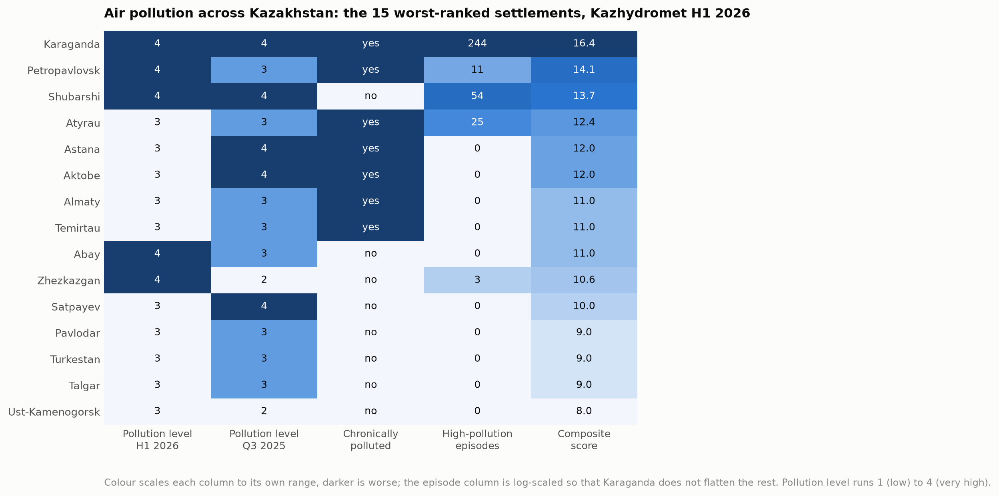
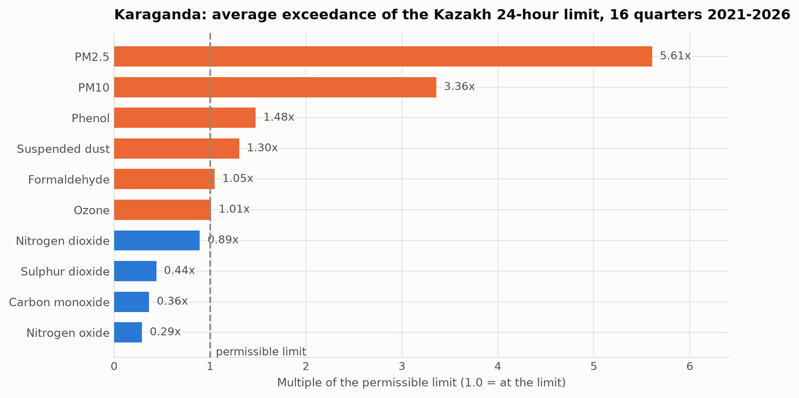
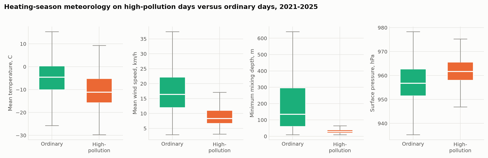
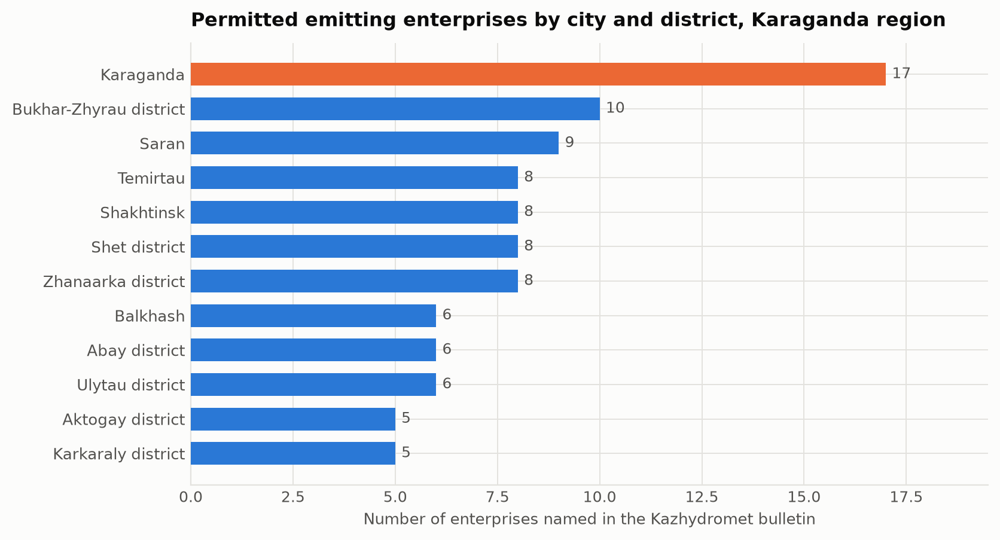

# Assessment and Analysis of Air Pollution in Karaganda, Kazakhstan

**Case Study Task 1**

## 1. Introduction

Air pollution is one of the most serious environmental problems in Kazakhstan. Coal-based heating, industry, mining and transport all contribute, and the continental climate makes the situation worse in winter, when cold and calm weather keeps emissions close to the ground.

This case study looks at one city: **Karaganda**, the centre of the Kazakh coal basin, with a population of about half a million.

Karaganda was chosen because it is the worst case in the country by the official measure. In the Kazhydromet national ranking for the first half of 2026, Karaganda holds first place among 70 monitored settlements, and it recorded 244 of the 337 high-pollution episodes registered across the whole of Kazakhstan in that period, which is 72 per cent of the national total.

The study uses five years of official monitoring data together with four years of daily weather and pollution reanalysis to answer five questions: which cities are worst affected, which pollutants are the problem, where the emissions come from, how the seasons change the picture, and what can realistically be done about it.

## 2. Literature review

Research on air quality in Kazakhstan has grown quickly over the last five years, and the findings are consistent.

Kerimray and colleagues documented trends in the main urban pollutants across Kazakh cities and estimated the associated health burden. They identified coal combustion in the residential and district-heating sectors as the main winter contributor [1].

Baimatova and co-authors used the COVID-19 lockdown as a natural experiment. Traffic dropped sharply, but the winter pollution peaks in Kazakh cities stayed. This shows that transport is not the main driver of the winter problem [2].

Tursun and colleagues applied source apportionment methods across several Kazakh cities and found coal combustion, secondary aerosol and industrial emissions to be the leading contributors to urban PM2.5 in Central Asia [3].

On the weather side, Tursumbayeva and colleagues showed that the height of the atmospheric mixing layer is a first-order control on PM2.5 in Almaty: when the layer is shallow, concentrations rise [4]. Almaty, however, sits in a mountain basin, which is usually given as the reason for its winter smog. Whether the same mechanism works on flat steppe is an open question, and this study answers it for Karaganda.

On policy, Agibayeva and colleagues examined Astana as a coal-heated city and described the options available to such municipalities [5], while Zhakiyev and co-authors reviewed the Kazakh regulatory framework and the gap between national limits and the WHO guidelines [6].

None of these studies covers Karaganda, which is the gap this case study fills.

## 3. Data description

Four public datasets were used. None requires registration or payment.

**Kazhydromet regional bulletins.** Twenty-four quarterly, half-yearly and annual bulletins for the Karaganda region, published between 2021 and 2026, downloaded as PDF from the Kazhydromet website. They were converted to text and parsed into three tables: concentrations of 15 substances over 24 reporting periods, the dates and monitoring posts of 169 high-pollution days, and a list of 105 emitting enterprises across the region.

**Kazhydromet national bulletins.** Two reports (Q3 2025 and H1 2026) giving the composite pollution ranking of 70 settlements, the number of monitoring posts per settlement and the national count of pollution episodes.

**ERA5 weather reanalysis.** Daily temperature, wind speed and direction, precipitation, snowfall, humidity, surface pressure and mixing-layer height for the Karaganda grid point (49.80 N, 73.11 E). 2083 days from 1 January 2021. Obtained through the Open-Meteo API [7].

**CAMS air quality reanalysis.** Daily PM2.5, PM10, NO2, SO2, CO and ozone for the same point. 1503 days from 4 August 2022. Also from Open-Meteo [8].

**Table 1.** Summary of the datasets.

| Dataset | Type | Coverage | Records |
|---|---|---|---|
| Kazhydromet regional bulletins | Ground measurements | 2021-2026, quarterly | 15 substances, 24 periods |
| Kazhydromet episode record | Ground measurements | 2021-2025, daily | 169 high-pollution days |
| Kazhydromet enterprise register | Administrative | 2026 | 105 enterprises |
| Kazhydromet national ranking | Administrative | H1 2026 | 70 settlements |
| ERA5 weather | Model reanalysis | 2021-2026, daily | 2083 days |
| CAMS air quality | Model reanalysis | 2022-2026, daily | 1503 days |

One limitation must be stated up front. The ground measurements and the reanalysis disagree strongly about absolute levels: over the ten overlapping quarters, Kazhydromet reports quarterly PM2.5 means of 119 to 430 ug/m3 while CAMS reports 6.9 to 11.3. The reanalysis grid cell is about 40 km across and averages the city with empty steppe, so it must underestimate an urban plume. The ground posts sit in the Prishakhtinsk district next to coal-burning housing, so they may overstate a city-wide average. Normalised to their own means, the two series correlate at r = 0.69, so **the timing in both is reliable and the absolute level in neither is**. Every conclusion about level in this report is therefore given as a range.

## 4. Methods

The analysis followed five steps.

**Data collection and cleaning.** Each bulletin PDF was converted to text with `pdftotext` and parsed by a dedicated script. Each script finishes with automatic checks and stops with an error if the parsed values fall outside the expected range, so a change in the bulletin layout cannot silently produce wrong numbers. Hourly reanalysis values were averaged into daily means and the sources were joined on the date.

**Time-series analysis.** The daily PM2.5 series was plotted with a 30-day rolling mean, and the monthly distribution was examined to find the seasonal pattern. The independent quarterly Kazhydromet series was used to check the amplitude of that pattern.

**Correlation with weather.** Pearson correlations were computed between each weather variable and PM2.5, for the whole record and separately for the heating and warm seasons.

**Episode analysis.** The 169 measured high-pollution days were compared against ordinary days using the same weather variables. The comparison was restricted to heating-season days, so the difference reflects the weather and not simply the calendar.

**Evaluation against standards.** Concentrations were compared against the WHO 2021 air quality guidelines [9]: for PM2.5, 5 ug/m3 as an annual mean and 15 ug/m3 as a 24-hour mean. Exceedance days were counted directly.

All analysis was done in Python with pandas and matplotlib. The code is in `build.py` and the accompanying notebook.

## 5. Results

### 5.1 Comparison of cities

Karaganda leads the national ranking with a composite score of 16.4, ahead of Petropavlovsk (14.1), Shubarshi (13.7) and Atyrau (12.4). Almaty, which dominates public discussion of air quality in Kazakhstan, is only seventh with 11.0.

The heatmap shows why. Karaganda is the only settlement that scores badly on every indicator at once: the highest pollution level in both reporting periods, classified as chronically polluted, and by far the largest number of episodes. Several cities match it on one indicator, none on all five.

Three of the fifteen worst settlements (Karaganda, Temirtau and Abay) are in the Karaganda region, which makes it the most affected administrative unit in the country.

### 5.2 Which pollutants are problematic

**Table 2.** Kazhydromet measurements for Karaganda, averaged over 16 quarterly reporting periods.

| Substance | Mean multiple of the 24-hour limit | Highest single measurement | Share of samples above the limit |
|---|---|---|---|
| PM2.5 | 5.61 | 40.9x | 94.5 % |
| PM10 | 3.36 | 21.9x | 20.9 % |
| Phenol | 1.48 | 4.0x | 6.4 % |
| Suspended dust | 1.30 | 9.4x | 16.1 % |
| Formaldehyde | 1.05 | 1.1x | 0 % |
| Ozone | 1.01 | 2.2x | 2.1 % |
| Nitrogen dioxide | 0.89 | 7.5x | 4.2 % |
| Sulphur dioxide | 0.44 | 2.5x | 0 % |
| Carbon monoxide | 0.36 | 5.0x | 11.7 % |

Fine particulate matter is the problem and nothing else comes close. PM2.5 averages 5.6 times the Kazakh 24-hour limit, one measurement reached 40.9 times the short-term limit, and the share of samples above the limit has been 100 per cent since 2022. PM10 follows at 3.4 times.

Phenol, at 1.48 times the limit, is the only gas with a constant exceedance, and points to coke and coal-chemical production. The usual combustion gases, sulphur dioxide, nitrogen dioxide and carbon monoxide, stay below their 24-hour limits on average. This is important: it indicates that the problem comes from low-level particulate sources rather than from tall industrial stacks.

### 5.3 Seasonal patterns

The ground measurements show a clear heating-season signal. Quarterly means for the first and fourth quarters run 0.19 to 0.43 mg/m3, against 0.11 to 0.23 for the second and third, a ratio of 1.5 to 2.

The episode record makes the seasonality unmistakable:

| Month | Jan | Feb | Mar | Apr | May-Aug | Sep | Oct | Nov | Dec |
|---|---|---|---|---|---|---|---|---|---|
| Episodes | 43 | 26 | 17 | 4 | 0 | 1 | 22 | 23 | 33 |

All 169 episodes fall between September and April. Sixty per cent are in December, January and February. There is not a single episode between May and August. Annual counts are 32, 44, 19, 39 and 35 for 2021 to 2025, with no downward trend.

### 5.4 The role of weather

Across the full record, PM2.5 correlates most strongly and negatively with mean wind speed (r = -0.41) and with mixing-layer height (r = -0.38). In the heating season both strengthen to about -0.49, while in the warm season they weaken to about -0.2. Dispersion matters most when there is most to disperse.

**Table 3.** Median weather conditions, heating season 2021 to 2025.

| Variable | Ordinary days | High-pollution days |
|---|---|---|
| Mean temperature | -4.5 C | -11.1 C |
| Mean wind speed | 16.4 km/h | 8.3 km/h |
| Minimum mixing depth | 135 m | 30 m |
| Surface pressure | 956.8 hPa | 961.8 hPa |

The pattern is clear. On episode days the temperature is 6.6 degrees lower, the wind speed is half, the mixing layer is less than a quarter as deep, and the pressure is 5 hPa higher. High pressure, hard frost, calm air and a mixing layer only tens of metres deep is a classic temperature inversion: the emissions have nowhere to go and stay at the level where people breathe.

This is the same mechanism reported for Almaty [4], and it shows that flat terrain gives no protection when a continental anticyclone settles over the city.

### 5.5 Sources of emission

The bulletins list 105 permitted enterprises across the region, with 585 thousand tonnes of emissions from stationary sources per year. Karaganda city has the largest count with 17. Their profile matches the measured pollutant mix: coal extraction and processing (Kuznetsky open pit, Kostenko mine), coal chemistry (Qaz Carbon), metallurgy and ferroalloys (Tau-Ken Temir, Asia FerroAlloys, KAZ Ferrit) and municipal waste handling.

Three facts, however, point past this list of permitted industry:

1. All 169 episodes were recorded at posts 6 and 8, and since 2024 only at post 8. Both are in Prishakhtinsk, a district of low-rise housing with individual coal stoves, not an industrial zone.
2. The substance that exceeds the limits is fine particulate matter, while the tall-stack combustion gases do not. That is the signature of low-level release.
3. The episodes require calm weather, and calm air concentrates near-ground emissions specifically.

Taken together, the evidence indicates that **domestic coal burning is the main driver of the episodes**, while permitted industry sets the elevated background. The wind on episode days comes from the south-east twice as often as usual, and the combined heat and power plant and mine spoil heaps lie in that direction from post 8, so an industrial contribution to the peaks cannot be ruled out.

### 5.6 Comparison with WHO standards

The WHO 2021 guideline for PM2.5 is 5 ug/m3 as an annual mean and 15 ug/m3 for a 24-hour mean [9].

Even the conservative reanalysis exceeds the annual guideline by about a factor of two every year, and 11.2 per cent of days exceed the 24-hour guideline. Using the ground measurements instead, annual means exceed the guideline by between 24 and 54 times.

Taking the two together as a range, the true annual mean for Karaganda is somewhere between roughly 30 and 150 ug/m3, that is, **6 to 30 times the WHO guideline**. The Kazakh national limit is about ten times weaker than the WHO value, so even full compliance with Kazakh law would leave residents well above the internationally recommended exposure.

## 6. Discussion

The five research questions can now be answered.

**Which Kazakhstani cities are worst affected?** Karaganda is first of 70 by the national composite score, followed by Petropavlovsk, Shubarshi and Atyrau. Four of the fifteen worst settlements are in the Karaganda region. Almaty, despite receiving most public attention, ranks seventh. One caveat: the ranking depends heavily on recorded episodes, and those depend on where the monitoring posts happen to be, so it measures the worst local exposure rather than the average across a city.

**Which pollutants are the problem?** Fine particulate matter, without qualification. PM2.5 averages 5.6 times the Kazakh limit with 100 per cent of samples above the limit since 2022, and PM10 follows. Phenol is the only gas with a persistent exceedance.

**What are the main sources?** Permitted industry in the city is dominated by coal mining, coal chemistry and ferroalloy production, and the region hosts 105 permitted emitters. But the measured episodes all occur at posts in a residential district, involve particles rather than stack gases, and need calm weather. Domestic coal burning is therefore the main driver of the peaks, with industry providing the background.

**How do the seasons affect pollution?** Strongly. Heating-season quarters run 1.5 to 2 times the warm-season quarters, all 169 episodes fall between September and April, and 60 per cent are in December to February. Within the heating season the weather correlations roughly double in strength, so season and weather reinforce each other.

**What can realistically be done?** See Section 7.

The central finding of this study is that Karaganda has an **emissions problem that becomes dangerous through a dispersion bottleneck**. Emissions continue all year, but it is the winter anticyclone, with its frost, calm and shallow mixing layer, that turns them into the episodes that put the city at the top of the national ranking. This matters for policy, because the two components call for different responses on different timescales.

A second finding concerns the evidence base itself. Two instruments in one district determine the national ranking of a city of half a million people. Those instruments also report a PM2.5 to PM10 ratio between 0.90 and 1.00 in every reporting period, against a normal urban value of 0.5 to 0.7, which suggests the size fractions are not being separated properly. Karaganda has two AirKaz sensors; Almaty has 153. Improving the monitoring network would resolve more uncertainty than any further analysis of the existing record.

## 7. Recommendations

### Short term, within one or two heating seasons

**Publish and act on episode warnings.** Kazhydromet already issues adverse-dispersion warnings and recorded 110 such days in the first half of 2026 alone. Those warnings should trigger a defined public response: free or discounted public transport, a ban on open-air waste burning, postponement of scheduled industrial maintenance releases, and restrictions on outdoor activity in schools. The trigger is simple and can be read from an ordinary weather forecast: wind below about 8 km/h combined with a shallow mixing layer during the heating season.

**Expand the monitoring network.** Twenty calibrated low-cost sensors across the districts of Karaganda would cost a fraction of one reference station and would establish, for the first time, whether the Prishakhtinsk readings represent the whole city or one neighbourhood. This is a prerequisite for evaluating any other measure.

**Fix the reference instruments.** The constant PM2.5 to PM10 ratio near 1.00 indicates a fault in the size separation. Until it is corrected, the absolute values behind the national ranking cannot be defended.

### Medium term, three to five years

**Target domestic coal burning in Prishakhtinsk and similar districts.** This is where the return per tenge is highest. The tools are connection to district heating where the network reaches, subsidised replacement of open stoves with certified low-emission units, and a switch to processed fuel with controlled ash content. A pilot limited to the catchment of post 8, with measurement before and after, would test the attribution directly and cheaply.

**Regulate the quality of coal sold to households.** Kazakhstan has one of the highest per capita household coal consumptions in the world. Setting and enforcing ash and volatile-matter limits on domestic coal is an administrative measure with no capital cost and an immediate effect.

**Require continuous emission monitoring at the largest sources.** Enterprises currently report annual totals. Continuous stack monitoring with public disclosure would make the industrial contribution to episodes measurable rather than inferred.

### Long term, five to ten years

**Decarbonise the heat supply.** Karaganda's heat comes from coal, and no measure that leaves this unchanged can bring annual means close to the WHO guideline. Realistic options are gas conversion of the combined heat and power plants where a pipeline is feasible, solar-assisted district heating, and deep retrofit of the building stock, which cuts both emissions and household bills.

**Plan the city for ventilation.** Since the episodes are caused by poor dispersion, planning decisions that affect airflow near the ground matter. Preserving ventilation corridors aligned with the prevailing wind, avoiding continuous building fronts across them, and revegetating mine spoil heaps all act on the mechanism the data identifies.

**Bring national limits closer to the WHO guidelines.** The Kazakh 24-hour limit for PM2.5 is roughly ten times weaker than the WHO value. A published convergence schedule would give industry and municipalities a planning horizon [6].

## 8. Conclusion

Karaganda is the most polluted settlement in Kazakhstan by the official measure, and this study shows why in specific terms.

Fine particulate matter is the problem, exceeding the Kazakh 24-hour limit by 5.6 times on average and the WHO guideline by somewhere between 6 and 30 times. The pollution is emitted all year but becomes dangerous seasonally: all 169 recorded episodes of the last five years fall between September and April, and on those days the wind drops by half and the mixing layer collapses from 135 to 30 metres. Flat steppe turns out to trap pollution as effectively as the mountain basin usually blamed for Almaty's smog.

The evidence points at domestic coal burning in low-rise districts as the main driver of the episodes, with permitted industry providing the elevated background. The cheapest effective measure available today is an episode warning service based on ordinary weather forecasts, which costs almost nothing and could be running within one heating season. It is not a substitute for reducing emissions, and the clearest target for that is household coal.

The largest obstacle to progress is the evidence base. Two instruments in one district decide the national ranking of a city of half a million, and those instruments show a fault that undermines their absolute readings. Twenty calibrated sensors would resolve more than any further analysis of the data that exists today.

## References

1. Kerimray, A.; Assanov, D.; Kenessov, B.; Karaca, F. Trends and health impacts of major urban air pollutants in Kazakhstan. *Journal of the Air & Waste Management Association* **2020**, *70*(11), 1148-1164. https://doi.org/10.1080/10962247.2020.1813837
2. Baimatova, N.; Omarova, A.; Muratuly, A.; Tursumbayeva, M.; Ibragimova, O.P.; Bukenov, B.; Kerimray, A. Seasonal variations and effect of COVID-19 lockdown restrictions on the air quality in the cities of Kazakhstan. *Environmental Processes* **2022**, *9*, 48. https://doi.org/10.1007/s40710-022-00603-w
3. Tursun, K.; Omarova, A.; Ibragimova, O.P.; Bukenov, B.; Tursumbayeva, M.; Mukhtarov, R.; Radelyuk, I.; Yenisoy-Karakas, S. Dominant sources of PM2.5 in Kazakhstan's urban cities: a PMF and HYSPLIT-based study for air quality management in Central Asia. *Urban Climate* **2025**, *64*, 102706. https://doi.org/10.1016/j.uclim.2025.102706
4. Tursumbayeva, M.; Kerimray, A.; Karaca, F.; Permadi, D.A. Planetary boundary layer and its relationship with PM2.5 concentrations in Almaty, Kazakhstan. *Aerosol and Air Quality Research* **2022**, *22*(8), 210294. https://doi.org/10.4209/aaqr.210294
5. Agibayeva, A.; Kumisbek, A.; Nauyryzbay, A.; Avcu, E.; Zhalgasbayev, K.; Karaca, F.; Guney, M. Towards sustainable air quality in coal-heated cities: a case study from Astana, Kazakhstan. *Sustainability* **2025**, *17*(22), 10214. https://doi.org/10.3390/su172210214
6. Zhakiyev, N.; Khamzina, A.; Sarkulova, Z.; Biloshchytskyi, A. Air quality and environmental policy in Kazakhstan: challenges, innovations, and pathways to cleaner air. *Urban Science* **2025**, *9*(11), 464. https://doi.org/10.3390/urbansci9110464
7. Hersbach, H.; Bell, B.; Berrisford, P.; et al. The ERA5 global reanalysis. *Quarterly Journal of the Royal Meteorological Society* **2020**, *146*(730), 1999-2049. https://doi.org/10.1002/qj.3803
8. Inness, A.; Ades, M.; Agusti-Panareda, A.; et al. The CAMS reanalysis of atmospheric composition. *Atmospheric Chemistry and Physics* **2019**, *19*(6), 3515-3556. https://doi.org/10.5194/acp-19-3515-2019
9. World Health Organization. *WHO Global Air Quality Guidelines*; World Health Organization: Geneva, 2021.
