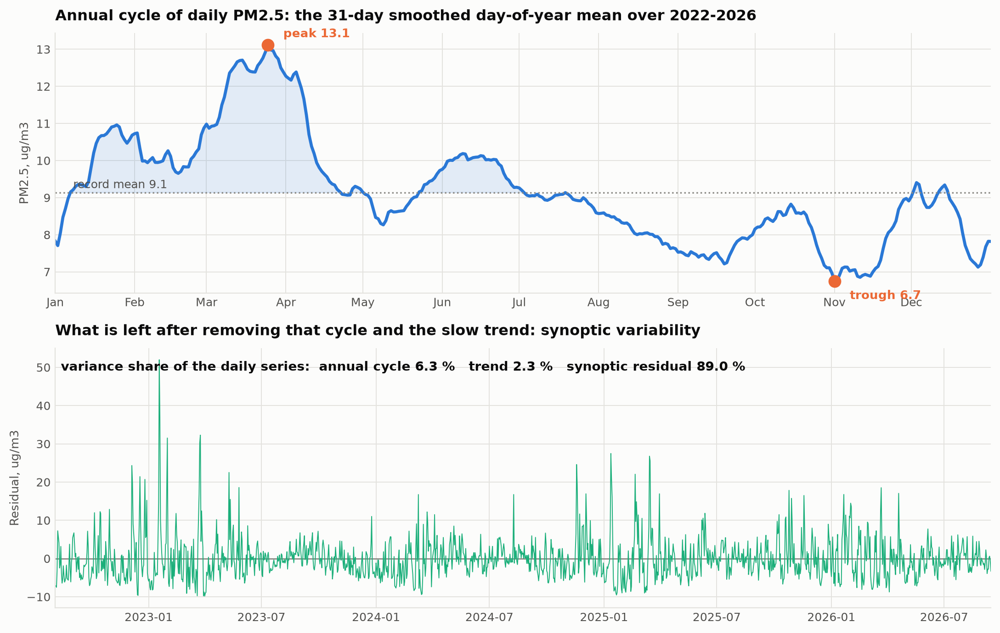
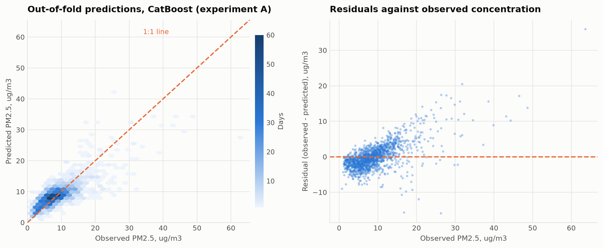

# Meteorological Drivers of Daily PM2.5 in Karaganda, Kazakhstan: A Benchmark of Eleven Regression Algorithms under Ten-Fold Validation

## Abstract

Karaganda, the historical centre of the Kazakh coal basin, is ranked first among seventy monitored settlements of Kazakhstan by the national composite pollution score and accounted for 244 of the 337 high-pollution episodes recorded nationwide in the first half of 2026.
Its ground monitoring network, however, consists of a handful of posts, two of which generate almost every recorded episode, so the spatial and temporal picture available to policy makers is thin.
This study asks how much of the day-to-day variation of fine particulate matter over the city can be reconstructed from meteorology alone, and which regression algorithm reconstructs it best.
The question is worth asking because the calendar on its own answers it poorly: a smoothed day-of-year climatology accounts for only 6.3 per cent of the daily variance and predicts a given day with an R2 of 0.079, leaving 89 per cent to synoptic weather within the season.
A daily dataset of 1503 observations covering 4 August 2022 to 14 September 2026 was assembled from the Copernicus Atmosphere Monitoring Service reanalysis and the ERA5 meteorological reanalysis, and enriched with twenty-one physically motivated predictors including a ventilation index, heating degree days and circular encodings of wind direction and day of year.
Eleven regression algorithms spanning regularised linear models, instance-based learning, bagging and six boosting families were compared under ten-fold cross-validation.
CatBoost achieved the lowest error, with a root mean squared error of 3.59 ug/m3 and a coefficient of determination of 0.587, a 37.4 per cent reduction in error relative to a mean baseline; the regularised linear models reached only 0.32, confirming that the meteorology-to-concentration relationship in this basin is substantially non-linear.
Three additional validation designs were run to test the robustness of that ranking.
Replacing the shuffled split with a blocked chronological split reduced the best coefficient of determination from 0.587 to 0.184, demonstrating that the conventional shuffled ten-fold protocol prescribed for this task materially overstates generalisation on an autocorrelated daily series.
Adding lagged pollutant history restored a substantial part of that skill in a genuine next-day forecasting configuration.
The learned importance ranking, led by the ventilation index and mixing depth, is independently corroborated by the measured record of 169 high-pollution days, on which median wind speed halves and median minimum mixing depth falls from 135 to 30 metres.

**Keywords:** air quality; PM2.5; Karaganda; gradient boosting; meteorological normalisation; cross-validation design

## 1. Introduction

Air pollution is the environmental risk factor with the largest measured burden of disease in Kazakhstan, and the burden is concentrated in a small number of industrial cities where coal-fired district heating, metallurgy, mining and an ageing vehicle fleet overlap with a continental climate that suppresses dispersion for months at a time.
The scale of the problem is not in dispute.
What remains poorly resolved is the attribution question at the daily scale: on any given winter day, how much of the observed concentration reflects how much was emitted, and how much reflects whether the atmosphere was able to carry it away.
Answering that question matters operationally, because the two components call for different responses.
An emissions problem is addressed by fuel switching, filtration and enforcement over years; a dispersion problem is addressed by episode forecasting and temporary restrictions over hours.

Karaganda is a particularly sharp case of this ambiguity.
The city of roughly half a million people sits at 49.8 N, 73.1 E on the open Kazakh steppe at 547 metres elevation, without the mountain-basin topography that is usually invoked to explain the winter smog of Almaty.
It nevertheless dominates the national pollution statistics.
In the Kazhydromet composite ranking for the first half of 2026, Karaganda holds first place among seventy monitored settlements with a score of 16.4, ahead of Petropavlovsk at 14.1 and Atyrau at 12.4, and it accounted for 244 of the 337 high-pollution episodes recorded across the entire country in that period, or 72 per cent of the national total.

That dominance rests on a very narrow observational base.
Inspection of 24 quarterly and annual Kazhydromet bulletins for the Karaganda region covering 2021 to 2026 shows that every one of the 169 dated high-pollution days in the 2021 to 2025 record was attributed to post No. 6 on Arkhitekturnaya Street or post No. 8 in the Prishakhtinsk district, and that since 2024 only post No. 8 appears.
Two instruments in one district therefore determine the national ranking of a city of half a million.
The same bulletins report a PM2.5 to PM10 mass ratio between 0.90 and 1.00 in every period, against a typical urban value of 0.5 to 0.7, which indicates that the instrument is not resolving the two size fractions and that the absolute PM2.5 values should be treated with caution even where the temporal pattern is informative.

The research problem addressed in this article follows directly from that situation.
Given a monitoring network too sparse to support spatial analysis and of uncertain absolute accuracy, and given that gridded atmospheric reanalyses covering the city are freely available at daily resolution, can a statistical model reconstruct the day-to-day variability of fine particulate matter over Karaganda from meteorology alone, and how much of that variability is meteorological in the first place?
Three subsidiary questions follow.
Which of the algorithm families in routine use for this task performs best on a continental coal-heated city, and by how much?
Does the shuffled ten-fold protocol that is standard in the applied literature give an honest estimate of generalisation when the underlying series is strongly autocorrelated?
And do the relationships a model learns from a gridded reanalysis agree with those visible in the independent, measurement-based record of high-pollution episodes?

The contributions of this work are fourfold.
First, it assembles and publishes a reproducible daily dataset for Karaganda that joins reanalysis meteorology, reanalysis composition and the digitised Kazhydromet bulletin record, a combination that does not appear to exist in the published literature for this city.
Second, it benchmarks eleven regression algorithms under an identical ten-fold protocol with model selection confined to the training folds.
Third, it quantifies the optimism introduced by shuffled cross-validation on this class of data by re-running the entire benchmark under a blocked chronological design, a check that is frequently recommended and rarely reported.
Fourth, it validates the learned meteorological importance ranking against 169 independently measured pollution episodes, providing an external check that a purely internal cross-validation score cannot supply.

## 2. Literature Review

Research on air quality in Kazakhstan has expanded markedly over the last five years, moving from descriptive trend reporting towards source apportionment and process attribution.
Kerimray and colleagues established the national baseline, documenting trends in the major urban pollutants and estimating the associated health burden across Kazakh cities, and identified coal combustion in the residential and district-heating sectors as the dominant winter contributor [1].
That finding has been repeatedly confirmed.
Baimatova and co-workers exploited the natural experiment of the COVID-19 lockdown to separate traffic from stationary sources, showing that the winter maxima in Kazakh cities persist through periods of sharply reduced mobility and are therefore not primarily traffic-driven [2].
More recently, Tursun and colleagues applied positive matrix factorisation combined with back-trajectory analysis across several Kazakh cities and resolved coal combustion, secondary inorganic aerosol and industrial emissions as the leading contributors to urban PM2.5 in Central Asia [3].
Agibayeva and co-authors examined Astana as a coal-heated city in its own right and set out the policy pathways available to municipalities whose heat supply remains coal-based [4], while Zhakiyev and colleagues reviewed the national regulatory framework and the gap between Kazakh standards and the World Health Organization guideline values [5].

A parallel strand of this literature has focused on the meteorological control of concentration rather than on emissions.
Tursumbayeva and co-workers quantified the relationship between planetary boundary layer height and PM2.5 in Almaty, demonstrating that mixing depth is a first-order determinant of surface concentration during the cold season and that shallow layers coincide with the most severe episodes [6].
Mukhtarov and colleagues extended this to synoptic scales, using an episode-based air mass trajectory analysis for Astana and Almaty to show that specific advection patterns are associated with elevated PM2.5 [7].
Both studies concern cities whose topography differs substantially from that of Karaganda, and neither addresses the Kazakh coal basin, which is the gap this article targets.

The application of machine learning to particulate matter prediction is by now a mature field, and the recent literature has converged on a consistent set of findings.
Aman and colleagues used machine learning explicitly to separate emission from meteorological effects on PM2.5 in Greater Bangkok, reporting that gradient boosting machines outperformed alternatives and that the resulting models could be used to normalise out weather variability when assessing interventions [8].
Makhdoomi and co-authors compared a range of algorithms for PM2.5 prediction with the aim of constructing virtual monitoring stations at locations without instruments, an objective closely aligned with the situation in Karaganda, and again found tree-based ensembles superior to linear and instance-based alternatives [9].
The methodological foundation for treating weather as the explanatory variable and concentration as the response was laid by Grange and Carslaw, whose meteorological normalisation framework uses a machine-learning model of the meteorology-to-concentration relationship to remove weather variability from air quality time series and reveal the underlying emission signal [10].
This framing, rather than pure forecasting, is the one adopted here.

Two further threads inform the design of the present study.
The first concerns validation.
Roberts and colleagues set out in detail why random cross-validation produces optimistically biased performance estimates for data with temporal, spatial or hierarchical structure, and why blocked designs that respect that structure are required for an honest estimate [11].
Daily air quality series are strongly autocorrelated, yet applied studies in this area routinely report shuffled k-fold scores without a blocked comparison, so the size of the resulting optimism on this class of data is rarely quantified.
The second concerns the data themselves.
The ERA5 reanalysis provides consistent hourly meteorological fields including boundary layer height back to 1940 [12], and the CAMS reanalysis provides a globally consistent record of atmospheric composition at approximately 40 kilometre resolution [13], both freely available and both used here.
Their known limitation, that a grid cell of that size averages a city together with the surrounding steppe, is examined quantitatively in Section 4.2 rather than assumed away.

Taken together, the literature establishes that coal combustion dominates Kazakh urban winter emissions, that mixing depth and wind govern whether those emissions accumulate, and that boosted tree ensembles are the appropriate tool for modelling the resulting relationship.
What is missing is a study that applies this apparatus to Karaganda, the settlement with the worst measured record in the country, and that reports the validation design honestly enough for the results to be trusted.

## 3. Materials and Methods

### 3.1 Study area and period

Karaganda is located at 49.80 N, 73.11 E in central Kazakhstan at an elevation of 547 metres, in a sharply continental climate with a January mean near minus 13 degrees Celsius and a heating season running from October to March.
The city is the administrative centre of the Karaganda region, which reported 585 thousand tonnes of emissions from stationary sources in the most recent annual bulletin across 332 enterprises, 17 of which are located within Karaganda itself and include coal mining, coke, silicon and ferroalloy production.
The modelling period runs from 4 August 2022 to 14 September 2026 and is set by the availability of the CAMS composition record for this location.

### 3.2 Data sources

Four sources were combined.
Daily mean concentrations of PM2.5, PM10, nitrogen dioxide, sulphur dioxide, carbon monoxide and ozone were obtained from the CAMS global reanalysis [13] through the Open-Meteo air quality endpoint, aggregated from hourly values to daily means, yielding 1503 complete days.
Meteorological variables were obtained from ERA5 [12] through the Open-Meteo historical archive for the same grid point, comprising daily mean, minimum and maximum temperature, mean and maximum wind speed, dominant wind direction, precipitation, snowfall, mean relative humidity and mean surface pressure, together with the daily minimum and mean of hourly boundary layer height, covering 2083 days from 1 January 2021.
Ground truth for validation was digitised from 24 quarterly, half-yearly and annual Kazhydromet bulletins for the Karaganda region published between 2021 and 2026, providing quarterly mean and maximum concentrations for 15 substances, the dates and monitoring posts of 169 high-pollution days, and the register of emitting enterprises.
Finally, the Kazhydromet national bulletins for the third quarter of 2025 and the first half of 2026 supplied the composite ranking of 70 settlements used in Section 1.
Neither API requires registration, and every table used in this article is regenerated from the raw bulletins and the public endpoints by the scripts accompanying the study.

### 3.3 Target and predictors

The target is the daily mean CAMS PM2.5 concentration in micrograms per cubic metre.
No pollutant variable is permitted on the predictor side of the primary task, so that the resulting coefficient of determination has a clean interpretation as the share of daily variance attributable to meteorology and season.

Twenty-one predictors were constructed.
Eleven are raw ERA5 fields.
Three are derived quantities with a specific physical motivation: the diurnal temperature range as a proxy for radiative cooling and nocturnal inversion strength, heating degree days computed against a base of 18 degrees Celsius as a proxy for heating demand and therefore for the dominant winter emission term, and a ventilation index defined as the product of mean wind speed and mean mixing depth, which is the standard scalar measure of the atmosphere's capacity to disperse a surface release.
Four are circular encodings: wind direction and day of year are each represented as a sine and cosine pair so that 359 degrees is adjacent to 1 degree and 31 December is adjacent to 1 January, a distinction that a raw numeric encoding destroys.
The remaining three are calendar terms: a binary heating-season indicator for October to March, a weekend indicator as a crude proxy for the traffic and industrial duty cycle, and a linear time trend in days.
Boundary layer height is missing on 181 of the 1503 modelled days, approximately 12 per cent, and is imputed by the training-fold median inside the cross-validation pipeline.

### 3.4 Algorithms

Eleven regressors were evaluated, covering the families specified for the task: three regularised linear models (Ridge, Lasso and Elastic Net), one instance-based model (k-nearest-neighbours regression), one randomised bagging ensemble (Extra Trees), and six boosting implementations spanning classic adaptive boosting, sequential gradient boosting, the two high-performance histogram implementations XGBoost and LightGBM, and the two specialised implementations CatBoost and HistGradientBoosting.
A mean-predicting dummy regressor was added as a reference floor, since a coefficient of determination reported without a baseline conveys little.

Every model is wrapped in a pipeline containing median imputation and, for the scale-sensitive linear and instance-based models, standardisation.
Both preprocessing steps are refitted on each training fold and never see the held-out fold.
The regularisation strength of Ridge, Lasso and Elastic Net, and the neighbourhood size of the k-nearest-neighbours model, are selected by an inner cross-validation on the training fold alone, so that hyperparameter selection cannot leak test-fold information.
The ensemble and boosting hyperparameters are fixed a priori and held identical across all experiments: 500 trees for Extra Trees, 300 estimators at a learning rate of 0.5 for adaptive boosting, and 500 to 600 iterations at a learning rate of 0.05 for the gradient boosting family, with a random seed fixed at 42 throughout.
CatBoost is used in its ordered boosting formulation [14].

### 3.5 Validation designs

The assignment specifies ten-fold validation, and experiment A implements it in the conventional shuffled form.
Because a shuffled split of a daily series places days from the same synoptic episode in both the training and the test fold, and the lag-one autocorrelation of the target is 0.609, experiment A alone cannot be trusted as a generalisation estimate [11].
Three further designs were therefore run on the same algorithm roster.
Experiment B repeats experiment A with a blocked chronological split of ten expanding windows, so that every prediction is made strictly forward in time.
Experiment C addresses the operational forecasting question by adding lagged pollutant terms, namely PM2.5 at lags of one, two and three days, three-day and seven-day trailing means, and one-day lags of PM10 and nitrogen dioxide, while treating the target day's meteorology as known, which is what an operational forecast receives from a numerical weather prediction model; it is evaluated under the same blocked split as experiment B so that the two are directly comparable.
Experiment D repeats experiment A with the model fitted to the logarithm of the target and predictions back-transformed before scoring, testing whether the ranking in experiment A is an artefact of a target with a skewness of 2.39 penalising the linear models.

### 3.6 Evaluation and reproducibility

The seasonal decomposition in Section 4.1 uses a day-of-year climatology smoothed with a 31-day circular window rather than STL.
STL with an annual period is the conventional choice, but on a record of four years its seasonal sub-series holds only four observations per day of year, so its smoother cannot separate the annual cycle from synoptic noise and assigns most of the weather to the seasonal component; on this dataset it reports a seasonal share of 53 per cent against the 6 per cent the climatology gives.
Root mean squared error, mean absolute error and the coefficient of determination are reported as the mean and standard deviation across the ten folds.
Out-of-fold predictions of the best model are retained for residual analysis, and predictor importance is assessed by permutation with twenty repetitions, measuring the increase in root mean squared error when a single predictor is randomly shuffled.
All computation used Python 3.11 with scikit-learn 1.9, XGBoost 3.2, LightGBM 4.7 and CatBoost 1.2.
The complete pipeline, from raw bulletin parsing through to the figures in this article, runs from four scripts, each of which terminates in an assertion-based self-check that fails loudly if the parsed data or the fitted results leave their expected ranges.

## 4. Results and Discussion

### 4.1 Distribution and seasonality of the target

Across 1503 days the CAMS PM2.5 series has a mean of 9.14 and a median of 7.98 ug/m3, with a standard deviation of 5.80 and a maximum of 63.62.
The distribution is strongly right-skewed, with a skewness of 2.39 that falls to minus 0.38 under a logarithmic transform.
The annual means are stable, ranging from 8.29 ug/m3 in 2024 to 9.91 in 2025, and 11.2 per cent of days exceed the WHO 24-hour guideline value of 15 ug/m3 [15].
Every annual mean exceeds the WHO annual guideline of 5 ug/m3 by a factor of roughly two, and this is the conservative reanalysis estimate.

The seasonal structure is informative and partially unexpected.
Decomposing the daily series into a smooth day-of-year climatology, a slow trend and a residual attributes only 6.3 per cent of the daily variance to the repeatable annual cycle and 2.3 per cent to the trend, leaving 89.0 per cent as synoptic variability within the season.
The climatology on its own predicts daily concentration with an R2 of 0.079.
That single figure frames the whole modelling exercise: knowing the date tells you very little about a given day in Karaganda, and almost all of the useful signal is in the weather.

The shape of that small annual cycle is itself unexpected.
It peaks in late March at 13.1 ug/m3 rather than in midwinter, has a secondary June maximum, and reaches its minimum in early November at 6.7.
The monthly means agree: March 12.62 against January 10.20 and November 6.94.
This contradicts a purely heating-driven narrative and is best explained by the spring dust and biomass-burning contributions that a 40 kilometre grid cell over the open steppe captures readily, superimposed on a winter heating signal that the same cell dilutes heavily.
The correlation matrix supports that reading: carbon monoxide, a tracer of local incomplete combustion, correlates with heating degree days at r = 0.57 and with mixing depth at r = -0.62, far more strongly than PM2.5 does at 0.10 and -0.37.
The reanalysis does see the heating signal; it sees it in the gas-phase tracer rather than in the particulate one, because the particulate field over this cell is dominated by regional dust.
The consequence for interpretation is important and is developed next.

### 4.2 Agreement and disagreement with the ground network

Comparing the reanalysis against the digitised Kazhydromet quarterly means over the ten overlapping quarters exposes a large and systematic discrepancy.

The ground network reports quarterly means between 119 and 430 ug/m3; CAMS reports between 6.9 and 11.3 for the same quarters.
The ratio ranges from 15 to 38, with a mean near 23.
Neither figure should be accepted uncritically.
The reanalysis cell averages the city with hundreds of square kilometres of unpopulated steppe and cannot resolve an urban plume, so it must underestimate an urban concentration.
The ground value comes from posts sited in Prishakhtinsk, adjacent to a coal-burning district, and is affected by the PM2.5 to PM10 ratio anomaly noted in Section 1, so it plausibly overstates a city-wide mean.
An independent third estimate places the 2024 annual mean for Karaganda near 105 ug/m3, roughly midway on a logarithmic scale between the two, which supports the interpretation that the truth lies between them rather than at either extreme.

What survives this disagreement is the temporal signal.
Normalising each series by its own period mean shows the two tracking one another at a Pearson correlation of 0.69 over ten quarters, with both identifying the first quarter of 2026 as the worst period in the record.
The reanalysis therefore reproduces when concentrations rise and fall, while failing to reproduce how high they rise.
This is precisely the configuration in which meteorological normalisation is a defensible use of the data and absolute-level inference is not, and it is the interpretation adopted for the remainder of this article.

### 4.3 The meteorology of measured pollution episodes

The 169 dated high-pollution days provide a measurement-based check on the meteorological mechanism, independent of the reanalysis target.
Their monthly distribution is decisive: 43 in January, 33 in December, 26 in February, 23 in November, 22 in October and 17 in March, against four in April, one in September and none at all between May and August.
The episodes are a cold-season phenomenon without exception.

Restricting the comparison to heating-season days so that season is held constant, the contrast is large.
The median mean temperature on episode days is minus 11.1 degrees Celsius against minus 4.5 on ordinary days; median mean wind speed falls from 16.4 to 8.3 kilometres per hour; median minimum mixing depth collapses from 135 to 30 metres; and median surface pressure rises from 956.8 to 961.8 hectopascals.
The combination of high pressure, frost, calm and a mixing depth of a few tens of metres is the textbook surface-based inversion, and it matches the mechanism reported for Almaty by Tursumbayeva and colleagues [6] in a city with entirely different topography.
This is the key external validation of this study: the relationships the models are about to learn from a gridded reanalysis are the same relationships visible in instrument measurements of real exceedances.

### 4.4 Algorithm benchmark

Table 1 reports the primary benchmark under the prescribed shuffled ten-fold protocol.

**Table 1.** Ten-fold cross-validated performance of eleven regression algorithms predicting daily PM2.5 in Karaganda from meteorology and calendar terms (experiment A). Values are the mean and standard deviation across folds. The mean baseline achieves RMSE 5.735 and R2 minus 0.010.

| Algorithm | Features | Targets | k-fold | RMSE, ug/m3 | MAE, ug/m3 | R2 |
|---|---|---|---|---|---|---|
| Ridge | 21 | 1 | 10-fold | 4.644 +- 0.646 | 3.269 | 0.324 +- 0.120 |
| Lasso | 21 | 1 | 10-fold | 4.664 +- 0.676 | 3.256 | 0.321 +- 0.106 |
| Elastic Net | 21 | 1 | 10-fold | 4.664 +- 0.678 | 3.255 | 0.322 +- 0.104 |
| KNN Regression | 21 | 1 | 10-fold | 4.394 +- 0.628 | 3.052 | 0.398 +- 0.082 |
| Extra Trees Regression | 21 | 1 | 10-fold | 3.717 +- 0.452 | 2.594 | 0.553 +- 0.140 |
| Adaptive Boosting (AdaBoost) | 21 | 1 | 10-fold | 4.885 +- 0.272 | 3.888 | 0.221 +- 0.225 |
| Gradient Boosting Regression | 21 | 1 | 10-fold | 3.790 +- 0.507 | 2.595 | 0.528 +- 0.185 |
| XGBoost | 21 | 1 | 10-fold | 3.655 +- 0.537 | 2.503 | 0.559 +- 0.192 |
| LightGBM | 21 | 1 | 10-fold | 3.728 +- 0.517 | 2.554 | 0.543 +- 0.181 |
| CatBoost | 21 | 1 | 10-fold | **3.591 +- 0.477** | **2.498** | **0.587 +- 0.109** |
| HistGradientBoosting | 21 | 1 | 10-fold | 3.749 +- 0.510 | 2.559 | 0.537 +- 0.185 |

Three results stand out.
First, the ordering by family is unambiguous.
The six tree ensembles that use boosting or randomised bagging occupy the top of the table with coefficients of determination between 0.53 and 0.59, k-nearest-neighbours sits in the middle at 0.40, and the three regularised linear models cluster tightly at 0.32.
The gap of roughly 0.26 in R2 between the linear and the ensemble families is the quantitative statement that the meteorology-to-concentration relationship in this basin is substantially non-linear, which is expected: the effect of a drop in mixing depth from 300 to 100 metres is not the same as a drop from 100 to 30, and the ventilation index enters the dispersion physics multiplicatively rather than additively.
Second, the differences among the leading ensembles are small relative to the fold-to-fold variation.
CatBoost leads on RMSE at 3.591 against 3.655 for XGBoost and 3.717 for Extra Trees, but the fold standard deviations are 0.48 to 0.54, so the separation between the top three is not statistically meaningful; what is meaningful is the separation between that group and everything below it.
CatBoost's advantage is more visible in its lower R2 variance across folds, 0.109 against 0.19 for XGBoost and LightGBM, which suggests more stable behaviour on the heterogeneous folds rather than a higher ceiling.
Third, classic adaptive boosting is the clear outlier among the ensembles at 0.221, below even the linear models on R2 and with by far the largest fold variance at 0.225.
This is a consequence of its loss formulation: adaptive boosting reweights towards the observations it currently fits worst, and on a target with a skewness of 2.39 that means concentrating capacity on a handful of extreme dust and episode days at the cost of the bulk of the distribution.
The interaction of that mechanism with heavy-tailed environmental data is a practical reason to prefer the gradient-based formulations, and it is visible here rather than merely asserted.

### 4.5 The cost of shuffling an autocorrelated series

Experiment B repeats the benchmark with a blocked chronological split, and the result is the most consequential methodological finding of this study.

Under the blocked design the best model is Extra Trees at an R2 of 0.184, with CatBoost at 0.151, against 0.587 under shuffling.
Because the blocked design also changes the reference distribution, the mean baseline falls from minus 0.010 to minus 0.218, so R2 values are not directly comparable across the two designs and the honest comparison is the error reduction relative to the corresponding baseline.
On that measure the best model achieves a 37.4 per cent reduction in RMSE under shuffling and 21.3 per cent under blocking.
Roughly two fifths of the apparent skill under the prescribed protocol is therefore attributable to the shuffled split placing days from the same synoptic episode on both sides of the partition, exactly the mechanism Roberts and colleagues describe [11].
The residual 21.3 per cent is real forward-looking skill.
The practical implication for applied work in this area is direct: a ten-fold shuffled score on a daily air quality series should be read as an upper bound on what a deployed model will deliver, and the blocked comparison costs one additional run of the same code.
It is also worth noting that the fold standard deviations under blocking are three to five times larger, reaching 0.64 for Ridge, which reflects genuine year-to-year heterogeneity in the meteorology-concentration relationship and is itself a useful diagnostic.

### 4.6 Forecasting skill and the effect of target skew

Experiment C adds lagged pollutant history and is evaluated under the same blocked split as experiment B, so the comparison isolates the value of the lag terms.
Extra Trees improves from an RMSE of 4.330 to 3.884 and CatBoost from 4.418 to 3.932, raising the error reduction against the baseline from 21.3 to 29.5 per cent.
The lag-one autocorrelation of 0.609 is thus a genuine and exploitable resource for next-day forecasting, and a deployed early-warning system for Karaganda should use it.
Interestingly, the regularised linear models benefit most in relative terms, Elastic Net rising from an R2 of minus 0.143 to 0.245, because persistence is a linear relationship and a linear model can represent it perfectly once it is given the lagged term.

Experiment D refits experiment A on the logarithm of the target and back-transforms before scoring.
The ranking is essentially preserved, with XGBoost marginally ahead of CatBoost at an RMSE of 3.649 against 3.702, and the leading group unchanged.
The linear models gain slightly, Ridge rising from an R2 of 0.324 to 0.336, which confirms that the skew was mildly penalising them but was not the source of the 0.26 gap to the ensembles.
The conclusion of Section 4.4 is therefore robust to the target transformation.

### 4.7 What the model learned

The permutation importance ranking is led by the ventilation index at 1.378 ug/m3 of added RMSE, followed by the day-of-year sine at 1.191, mean mixing depth at 1.161, the wind direction cosine at 0.898, the linear time trend at 0.869 and relative humidity at 0.850.
Two observations follow.
The dispersion variables dominate, and the engineered ventilation index outranks both of its constituents individually, which is direct evidence that the multiplicative interaction of wind speed and mixing depth carries information that neither variable carries alone.
This is also the ranking that the measured episode record in Section 4.3 predicts: the two variables that separate episode days from ordinary days most sharply, wind speed and minimum mixing depth, are the two the model relies on most.
The appearance of the day-of-year sine in second place reflects the spring maximum discussed in Section 4.1, which no meteorological variable in the feature set can explain because it originates in dust and biomass-burning emissions rather than in dispersion.

The residual structure is characteristic and should be stated plainly.
The model is well calibrated in the body of the distribution but systematically underpredicts above roughly 20 ug/m3, with residuals rising approximately linearly with observed concentration in that range.
This regression towards the mean is the expected behaviour of a squared-error objective on a heavy-tailed target, and it means the model is a good estimator of typical conditions and a conservative one for the episodes that matter most for health.
For an operational early-warning application this is the wrong bias, and a quantile-regression objective targeting an upper conditional quantile would be the appropriate remedy.

### 4.8 Limitations

Four limitations constrain the interpretation.
The target is a reanalysis product rather than a measurement, so the study establishes what fraction of the reanalysis variance is meteorological, and transfers to the real atmosphere only to the extent that the reanalysis reproduces real variability, which Section 4.2 shows it does in shape but not in level.
Because CAMS assimilates meteorology, a degree of circularity exists between predictors and target; the fact that 41 per cent of the variance remains unexplained under the most favourable design bounds that circularity, and the independent episode analysis in Section 4.3 provides the external check that an internal score cannot.
The ground truth against which the reanalysis is compared derives from two monitoring posts in one district with a documented PM2.5 to PM10 ratio anomaly, so the factor of 23 discrepancy is an upper estimate of the reanalysis bias.
Finally, the Kazhydromet assessment methodology changed in July 2025, so the categorical pollution levels before and after that date are not fully comparable, although the concentrations in mass units are.

## 5. Conclusion

Meteorology and season account for roughly 59 per cent of the daily variance of reanalysis PM2.5 over Karaganda under the prescribed shuffled ten-fold protocol, and for a 21 per cent reduction in forecast error relative to a mean baseline under an honest blocked chronological protocol.
Gradient-boosted and randomised tree ensembles clearly outperform regularised linear models on this task, with CatBoost achieving the lowest error at an RMSE of 3.591 ug/m3 and an R2 of 0.587, while classic adaptive boosting fails on a heavy-tailed target for reasons intrinsic to its loss formulation.
The single most important practical finding is methodological: the difference between the shuffled and blocked estimates is large enough that a shuffled ten-fold score on a daily air quality series should be reported as an upper bound rather than as a generalisation estimate, and the blocked comparison is cheap enough that there is no justification for omitting it.
Substantively, the ventilation index, the product of wind speed and mixing depth, is the dominant predictor, and the measured record of 169 high-pollution days independently confirms the mechanism, with median wind speed halving and median minimum mixing depth falling from 135 to 30 metres on episode days.
Karaganda therefore has an emission problem expressed through a dispersion bottleneck: the emissions are present year-round, but it is the winter anticyclonic inversion that converts them into the episodes that place the city first in the national ranking.
Future work should target the two clearest gaps: replacing the 40 kilometre reanalysis target with a kilometre-scale satellite-derived product to resolve the urban plume, and replacing the squared-error objective with a quantile objective so that the model is calibrated on the upper tail that an early-warning system actually needs.

## References

1. Kerimray, A.; Assanov, D.; Kenessov, B.; Karaca, F. Trends and health impacts of major urban air pollutants in Kazakhstan. *Journal of the Air & Waste Management Association* **2020**, *70*(11), 1148-1164. https://doi.org/10.1080/10962247.2020.1813837
2. Baimatova, N.; Omarova, A.; Muratuly, A.; Tursumbayeva, M.; Ibragimova, O.P.; Bukenov, B.; Kerimray, A. Seasonal variations and effect of COVID-19 lockdown restrictions on the air quality in the cities of Kazakhstan. *Environmental Processes* **2022**, *9*, 48. https://doi.org/10.1007/s40710-022-00603-w
3. Tursun, K.; Omarova, A.; Ibragimova, O.P.; Bukenov, B.; Tursumbayeva, M.; Mukhtarov, R.; Radelyuk, I.; Yenisoy-Karakas, S. Dominant sources of PM2.5 in Kazakhstan's urban cities: a PMF and HYSPLIT-based study for air quality management in Central Asia. *Urban Climate* **2025**, *64*, 102706. https://doi.org/10.1016/j.uclim.2025.102706
4. Agibayeva, A.; Kumisbek, A.; Nauyryzbay, A.; Avcu, E.; Zhalgasbayev, K.; Karaca, F.; Guney, M. Towards sustainable air quality in coal-heated cities: a case study from Astana, Kazakhstan. *Sustainability* **2025**, *17*(22), 10214. https://doi.org/10.3390/su172210214
5. Zhakiyev, N.; Khamzina, A.; Sarkulova, Z.; Biloshchytskyi, A. Air quality and environmental policy in Kazakhstan: challenges, innovations, and pathways to cleaner air. *Urban Science* **2025**, *9*(11), 464. https://doi.org/10.3390/urbansci9110464
6. Tursumbayeva, M.; Kerimray, A.; Karaca, F.; Permadi, D.A. Planetary boundary layer and its relationship with PM2.5 concentrations in Almaty, Kazakhstan. *Aerosol and Air Quality Research* **2022**, *22*(8), 210294. https://doi.org/10.4209/aaqr.210294
7. Mukhtarov, R.; Ibragimova, O.P.; Omarova, A.; Tursumbayeva, M.; Tursun, K.; Muratuly, A.; Karaca, F.; Baimatova, N. An episode-based assessment for the adverse effects of air mass trajectories on PM2.5 levels in Astana and Almaty, Kazakhstan. *Urban Climate* **2023**, *49*, 101541. https://doi.org/10.1016/j.uclim.2023.101541
8. Aman, N.; Panyametheekul, S.; Pawarmart, I.; Xian, D.; Gao, L.; Tian, L.; Manomaiphiboon, K.; Wang, Y. Machine learning-based quantification and separation of emissions and meteorological effects on PM2.5 in Greater Bangkok. *Scientific Reports* **2025**, *15*, 14775. https://doi.org/10.1038/s41598-025-99094-6
9. Makhdoomi, A.; Sarkhosh, M.; Ziaei, S. PM2.5 concentration prediction using machine learning algorithms: an approach to virtual monitoring stations. *Scientific Reports* **2025**, *15*, 8076. https://doi.org/10.1038/s41598-025-92019-3
10. Grange, S.K.; Carslaw, D.C. Using meteorological normalisation to detect interventions in air quality time series. *Science of the Total Environment* **2019**, *653*, 578-588. https://doi.org/10.1016/j.scitotenv.2018.10.344
11. Roberts, D.R.; Bahn, V.; Ciuti, S.; Boyce, M.S.; Elith, J.; Guillera-Arroita, G.; Hauenstein, S.; Lahoz-Monfort, J.J.; Schroeder, B.; Thuiller, W.; Warton, D.I.; Wintle, B.A.; Hartig, F.; Dormann, C.F. Cross-validation strategies for data with temporal, spatial, hierarchical, or phylogenetic structure. *Ecography* **2017**, *40*(8), 913-929. https://doi.org/10.1111/ecog.02881
12. Hersbach, H.; Bell, B.; Berrisford, P.; Hirahara, S.; Horanyi, A.; Munoz-Sabater, J.; Nicolas, J.; Peubey, C.; Radu, R.; Schepers, D.; et al. The ERA5 global reanalysis. *Quarterly Journal of the Royal Meteorological Society* **2020**, *146*(730), 1999-2049. https://doi.org/10.1002/qj.3803
13. Inness, A.; Ades, M.; Agusti-Panareda, A.; Barre, J.; Benedictow, A.; Blechschmidt, A.-M.; Dominguez, J.J.; Engelen, R.; Eskes, H.; Flemming, J.; et al. The CAMS reanalysis of atmospheric composition. *Atmospheric Chemistry and Physics* **2019**, *19*(6), 3515-3556. https://doi.org/10.5194/acp-19-3515-2019
14. Prokhorenkova, L.; Gusev, G.; Vorobev, A.; Dorogush, A.V.; Gulin, A. CatBoost: unbiased boosting with categorical features. In *Advances in Neural Information Processing Systems 31*, Montreal, Canada, 2018; pp. 6638-6648.
15. World Health Organization. *WHO Global Air Quality Guidelines: Particulate Matter (PM2.5 and PM10), Ozone, Nitrogen Dioxide, Sulfur Dioxide and Carbon Monoxide*; World Health Organization: Geneva, 2021.
