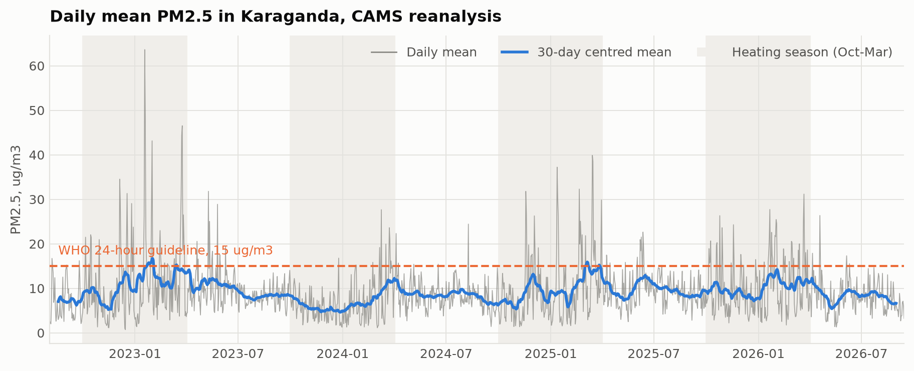
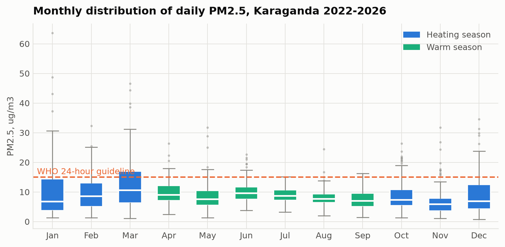
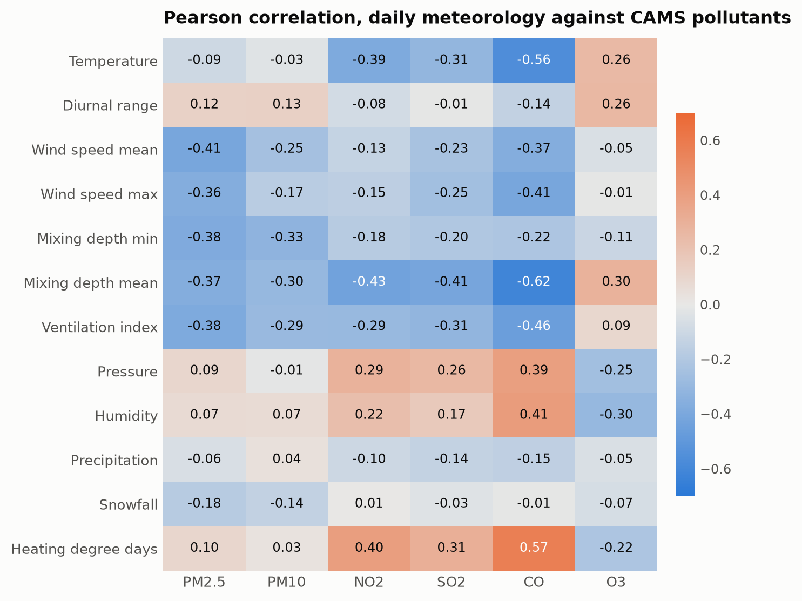

# Assessment and Analysis of Air Pollution in Karaganda, Kazakhstan

**Case Study Task 1 - final report**

## 1. Introduction

Karaganda is the historical centre of the Kazakh coal basin and, by the measure the national environmental agency itself uses, the most polluted settlement in Kazakhstan.
In the Kazhydromet composite ranking for the first half of 2026 it holds first place among seventy monitored settlements, and it accounted for 244 of the 337 high-pollution episodes recorded across the whole country in that period.
This report investigates why, using the full public record available for the city: 24 Kazhydromet bulletins covering 2021 to 2026, four years of gridded atmospheric reanalysis, and the national settlement ranking.

The motivation is that the two obvious explanations for the city's position are not equivalent in their policy consequences.
If Karaganda is polluted because it emits more than other cities, the response is industrial regulation and fuel substitution over a decade.
If it is polluted because its winter atmosphere cannot disperse what it emits, the response also includes episode forecasting, heating-load management on inversion days, and temporary operational restrictions, all of which can be implemented in a season rather than a decade.
Distinguishing the two requires daily data and a quantitative model, which is what this study builds.

A second motivation is that the evidence base itself deserves scrutiny.
The city's national ranking rests on a very small number of instruments, and this report treats the reliability of that evidence as part of the object of study rather than as an assumption.

### 1.1 Objectives

The study follows the six objectives set out in the case brief: analyse publicly available air quality data for Kazakhstan, compare pollution levels across cities, identify the primary sources of contamination, evaluate seasonal patterns, assess the health and environmental risk against international standards, and propose evidence-based measures.
It answers the five research questions of the brief directly in Section 6.

## 2. Literature review

Research on Kazakh urban air quality has grown substantially in the last five years and has converged on a consistent picture.
Kerimray and colleagues established the national baseline, documenting trends in urban pollutants and the associated health burden, and identified coal combustion in the residential and district-heating sectors as the dominant winter contributor [1].
Baimatova and co-workers used the COVID-19 lockdown as a natural experiment and showed that winter maxima in Kazakh cities persist through periods of sharply reduced traffic, which rules out mobility as the primary winter driver [2].
Tursun and colleagues applied positive matrix factorisation with back-trajectory analysis across several Kazakh cities and resolved coal combustion, secondary inorganic aerosol and industrial emissions as the leading contributors to urban PM2.5 in Central Asia [3].

On the meteorological side, Tursumbayeva and colleagues quantified the link between planetary boundary layer height and PM2.5 in Almaty, showing that mixing depth is a first-order control on surface concentration during the cold season [4].
Mukhtarov and co-workers extended this to the synoptic scale with an episode-based air mass trajectory analysis for Astana and Almaty [5].
Both studies concern cities whose topography differs from Karaganda's; Almaty in particular sits in a mountain basin, and its winter smog is routinely attributed to that setting.
Whether the same mechanism operates on the open steppe is an open question that this report addresses.

On the policy side, Agibayeva and colleagues examined Astana as a coal-heated city and set out the pathways available to municipalities whose heat supply remains coal-based [6], and Zhakiyev and co-authors reviewed the national regulatory framework and the distance between Kazakh limit values and the World Health Organization guidelines [7].
No study in this literature focuses on Karaganda, which is the gap this report addresses.

## 3. Data description

Four datasets were assembled, all public and all reproducible from the scripts accompanying this report.

**Kazhydromet bulletins.**
Twenty-four quarterly, half-yearly and annual bulletins for the Karaganda region, published between 2021 and 2026, were downloaded as PDF and parsed into three tables: a concentration series covering 15 substances over 24 reporting periods, the dates and monitoring posts of 169 high-pollution days, and a register of 105 emitting enterprises across 16 cities and districts of the region, of which 17 are located in Karaganda itself.
Concentrations are reported in mg/m3 together with the ratio to the Kazakh maximum permissible concentration, both the 24-hour and the single-measurement limit, and the share of samples above the limit.

**National bulletins.**
The Kazhydromet national reports for the third quarter of 2025 and the first half of 2026 supplied the composite pollution ranking of 70 settlements, the national count of high-pollution episodes, and the number of monitoring posts per settlement.

**ERA5 meteorological reanalysis.**
Daily meteorology for the grid point at 49.80 N, 73.11 E over 2083 days from 1 January 2021: mean, minimum and maximum temperature, mean and maximum wind speed, dominant wind direction, precipitation, snowfall, relative humidity and surface pressure, plus the daily minimum and mean of hourly boundary layer height [8].
Boundary layer height is absent on 181 days.

**CAMS composition reanalysis.**
Daily mean PM2.5, PM10, nitrogen dioxide, sulphur dioxide, carbon monoxide and ozone for the same point over 1503 days from 4 August 2022 [9].
This is a model product at roughly 40 kilometre resolution, not an instrument reading, and Section 5.2 quantifies what that means in practice.

Both reanalyses were obtained through the Open-Meteo REST API, which requires no registration.
One data quality defect was found and is documented in `KNOWN_ISSUES.md`: the sample-exceedance percentage column is mis-parsed for hydrogen sulfide rows, reaching impossible values above 100 per cent. Hydrogen sulfide is not used anywhere in this analysis, and all other substances were spot-checked against the source PDFs.

## 4. Methods

The analysis proceeds in five steps, matching the methodology in the case brief.

**Collection and cleaning.**
Each bulletin PDF is converted to text and parsed by a dedicated script that terminates in assertion-based self-checks; if the bulletin layout changes and the parse drifts, the script fails rather than emitting silently wrong numbers.
Reanalysis hourly values are aggregated to daily means, and the three sources are joined on the date index.

**Time-series and seasonal analysis.**
The daily PM2.5 series is separated into a smooth day-of-year climatology, a slow trend and a synoptic residual, and the variance share of each is reported.
STL with an annual period was tried first and rejected: on a four-year record its seasonal sub-series holds four observations per day of year, so it cannot distinguish the annual cycle from synoptic noise and attributes most of the weather to the seasonal component.
The day-of-year climatology, smoothed with a 31-day circular window, does the separation the question needs.
The quarterly Kazhydromet series is used independently to verify the amplitude of the seasonal cycle.

**Correlation with weather.**
Pearson correlations are computed between every meteorological variable and every pollutant, over the full record and separately for the heating and warm seasons, to test whether the dispersion relationship strengthens in winter as the inversion mechanism predicts.

**Episode analysis.**
The 169 measured high-pollution days are compared against ordinary days using the same meteorological variables.
The comparison is restricted to heating-season days so that season is held constant and the contrast reflects synoptic conditions rather than the calendar.

**Predictive modelling.**
Eleven regression algorithms were trained to predict daily PM2.5 from 21 meteorological and calendar predictors under ten-fold cross-validation, with three additional validation designs as robustness checks.
The full methodology and the complete benchmark are reported in the companion research article; Section 5.5 summarises the outcome relevant to this report.

**Evaluation against standards.**
Concentrations are compared against the WHO 2021 air quality guidelines [10]: 5 ug/m3 annual and 15 ug/m3 for the 24-hour mean for PM2.5, and 15 and 45 ug/m3 respectively for PM10.
Exceedance days are counted directly.

## 5. Results

### 5.1 Karaganda in national context

Karaganda leads the national ranking with a composite score of 16.4, ahead of Petropavlovsk at 14.1, Shubarshi at 13.7 and Atyrau at 12.4.
Almaty, the city that dominates public discussion of air quality in Kazakhstan, ranks seventh at 11.0.
The gap is driven almost entirely by the episode count: Karaganda recorded 244 high-pollution cases in the first half of 2026, Shubarshi 54, Atyrau 25 and Petropavlovsk 11, with most listed settlements recording none.
Three of the fifteen worst-ranked settlements (Karaganda, Temirtau and Abay) lie in the Karaganda region, and a fourth, Balkhash, is also in the region, which makes this the most affected administrative unit in the country.

### 5.2 Concentration levels and how far they can be trusted

The two available measures of PM2.5 in Karaganda disagree by more than an order of magnitude, and reconciling them is a prerequisite for any downstream conclusion.

**Table 1.** Quarterly mean PM2.5 from the two sources, ug/m3.

| Quarter | Kazhydromet | CAMS | Ratio |
|---|---|---|---|
| 2022Q3 | 119 | 6.9 | 17 |
| 2022Q4 | 230 | 9.5 | 24 |
| 2024Q3 | 150 | 8.3 | 18 |
| 2024Q4 | 220 | 8.3 | 26 |
| 2025Q1 | 250 | 11.3 | 22 |
| 2025Q2 | 150 | 10.1 | 15 |
| 2025Q3 | 150 | 9.1 | 17 |
| 2025Q4 | 220 | 9.2 | 24 |
| 2026Q1 | 430 | 11.3 | 38 |
| 2026Q2 | 230 | 8.5 | 27 |

The ground network reports between 119 and 430 ug/m3; the reanalysis reports between 6.9 and 11.3 for the same quarters, a ratio of 15 to 38 with a mean near 23.
Both numbers have known biases in opposite directions.
The reanalysis grid cell spans roughly 40 kilometres and averages the city with a large area of unpopulated steppe, so it cannot resolve an urban plume and must underestimate an urban concentration.
The ground figure comes from posts 6 and 8, sited in the Prishakhtinsk district adjacent to coal-burning residential housing, and the bulletins report a PM2.5 to PM10 mass ratio between 0.90 and 1.00 in every reporting period, against a typical urban value of 0.5 to 0.7, which indicates the instrument is not resolving the two size fractions.
An independent commercial assessment places the 2024 annual mean for Karaganda near 105 ug/m3, approximately midway on a logarithmic scale between the two estimates.
The reasonable conclusion is that the true city-wide annual mean lies somewhere between roughly 30 and 150 ug/m3, that is, between six and thirty times the WHO annual guideline of 5 ug/m3, and that neither source should be quoted as a point estimate.

What both sources agree on is the temporal pattern.
Normalised to their own means, the two series correlate at a Pearson coefficient of 0.69 over the ten overlapping quarters and both identify the first quarter of 2026 as the worst period on record.
Every analysis in this report that depends on timing is therefore well supported; any claim about absolute level is not, and is stated as a range.

### 5.3 Which pollutants are problematic

**Table 2.** Kazhydromet measurements for Karaganda, mean across 16 quarterly reporting periods, ordered by exceedance of the Kazakh 24-hour permissible limit.

| Substance | Mean ratio to 24-hour limit | Maximum single-measurement ratio | Mean share of samples above limit, % |
|---|---|---|---|
| PM2.5 | 5.61 | 40.9 | 94.5 |
| PM10 | 3.36 | 21.9 | 20.9 |
| Phenol | 1.48 | 4.0 | 6.4 |
| Suspended particles (dust) | 1.30 | 9.4 | 16.1 |
| Formaldehyde | 1.05 | 1.1 | 0.0 |
| Ozone | 1.01 | 2.2 | 2.1 |
| Nitrogen dioxide | 0.89 | 7.5 | 4.2 |
| Sulphur dioxide | 0.44 | 2.5 | 0.0 |
| Carbon monoxide | 0.36 | 5.0 | 11.7 |
| Nitrogen oxide | 0.29 | 5.6 | 2.1 |

Fine particulate matter is the problem, and nothing else is close.
PM2.5 averages 5.6 times the Kazakh 24-hour limit across the whole record, with a single measurement reaching 40.9 times the short-term limit, and the share of samples above the limit has stood at 100 per cent since 2022.
PM10 follows at 3.4 times, and the near-unity PM2.5 to PM10 ratio means the two are effectively measuring the same thing.
Phenol, at 1.48 times the limit on average, is the only gaseous species with a persistent exceedance and points to coke and coal-chemical processes rather than combustion.
The classic combustion gases, sulphur dioxide, nitrogen dioxide and carbon monoxide, remain below their 24-hour limits on average despite occasional short-term spikes, which is consistent with the picture of a particulate problem originating in low-stack residential and industrial coal burning rather than in high-stack power generation.

### 5.4 Seasonality and the timing of risk

The decomposition attributes 6.3 per cent of the daily variance to the repeatable annual cycle, 2.3 per cent to the slow trend and 89.0 per cent to synoptic variability within the season.
Knowing the date alone predicts a given day's concentration with an R2 of only 0.079.
There is no detectable improvement or deterioration over the four years of record.
The practical reading is that the calendar tells a resident of Karaganda which months to worry about, but only the weather tells them which days.

The two data sources disagree about the shape of the annual cycle, and the disagreement is informative.
The Kazhydromet quarterly series shows a clean heating-season signal: first and fourth quarter means of 0.19 to 0.43 mg/m3 against second and third quarter means of 0.11 to 0.23, a ratio of 1.5 to 2.
The reanalysis, by contrast, peaks in March at 12.6 ug/m3 rather than January at 10.2, with a minimum in November at 6.9.
The most likely explanation is that the 40 kilometre cell readily captures the spring dust and steppe-fire contribution that affects the whole region, while diluting the localised winter heating plume that the Prishakhtinsk posts sit inside.
Both signals are real; they belong to different spatial scales.
The correlation matrix in Figure 7 supports this: carbon monoxide, a tracer of local incomplete combustion, correlates with heating degree days at r = 0.57 and with mixing depth at r = -0.62, whereas PM2.5 manages only 0.10 and -0.37.
The reanalysis does see the heating season; it sees it in the gas-phase tracer rather than in the particulate field, which over this cell is dominated by regional dust.

For risk management the measured episode record settles the question.
Of 169 high-pollution days, 43 fell in January, 33 in December, 26 in February, 23 in November, 22 in October and 17 in March, against four in April, one in September and none at all from May to August.
The annual counts are 32, 44, 19, 39 and 35 for 2021 through 2025, with no downward trend.
Every episode that matters happens between October and April, and 60 per cent of them happen in December, January and February.

### 5.5 What drives the episodes

Across the full record, PM2.5 correlates most strongly and negatively with mean wind speed (r = -0.41), the ventilation index (-0.39), minimum mixing depth (-0.38) and mean mixing depth (-0.37).
Temperature, humidity and pressure correlate weakly.
Splitting by season sharpens the picture exactly as the inversion mechanism predicts: in the heating season the wind correlation strengthens to -0.49 and the minimum mixing depth correlation to -0.48, while in the warm season both weaken to around -0.2.
Dispersion matters most when there is most to disperse.

**Table 3.** Median meteorological conditions, heating season 2021 to 2025.

| Variable | Ordinary days | High-pollution days |
|---|---|---|
| Mean temperature, C | -4.5 | -11.1 |
| Mean wind speed, km/h | 16.4 | 8.3 |
| Minimum mixing depth, m | 135 | 30 |
| Surface pressure, hPa | 956.8 | 961.8 |

The contrast is unambiguous and is the central empirical finding of this report.
On episode days the median temperature is 6.6 degrees lower, the median wind speed is half, the median minimum mixing depth is less than a quarter, and surface pressure is 5 hectopascals higher.
High pressure, hard frost, calm and a mixing layer a few tens of metres deep is the signature of a surface-based temperature inversion, which traps emissions from low stacks and domestic chimneys in the layer where people breathe.
This is the same mechanism reported for Almaty [4], a city usually said to owe its smog to its mountain basin; Karaganda demonstrates that flat terrain is no protection when the continental anticyclone sets in.

The predictive modelling confirms and quantifies this.
Of eleven algorithms benchmarked under ten-fold cross-validation, CatBoost performed best, explaining 58.7 per cent of daily variance from meteorology and calendar terms alone, with a root mean squared error of 3.59 ug/m3 against 5.74 for a mean baseline.
Permutation importance ranks the ventilation index first, ahead of both of its constituents taken separately, confirming that it is the combination of wind and mixing depth, not either alone, that determines whether a given day becomes an episode.
Under a stricter blocked chronological validation the model still reduces forecast error by 21 per cent against the baseline, and adding the previous days' concentrations raises that to 30 per cent, which is the level of skill a practical next-day warning system could expect.

### 5.6 Sources of emission

The regional bulletins list 332 enterprises with emission permits across the Karaganda region and a regional total of 585 thousand tonnes of emissions from stationary sources per year.
Seventeen permitted enterprises lie within Karaganda city, and their profile is consistent with the measured pollutant mix: coal extraction and processing (Kuznetsky open pit, Kostenko mine, Alyans Ugol, Transkomir), coal chemistry and carbon products (Qaz Carbon), metallurgy and ferroalloys (Tau-Ken Temir, Asia FerroAlloys and its sinter plant, KAZ Ferrit), and municipal waste handling (GorKomTrans, Karaganda-Recycling, EkoLider).
The largest emitters in the region as a whole are outside the city: Kazakhmys, Qarmet in Temirtau, and the Temirtau electrometallurgical plant.

Three features of the measured record point beyond this permitted-industry list.
First, all 169 recorded episodes come from posts 6 and 8, and since 2024 only from post 8 in Prishakhtinsk, a district of low-rise housing with individual coal stoves rather than an industrial zone.
Second, the pollutant that exceeds limits is fine particulate matter while the high-stack combustion gases do not, which is the signature of low-level rather than elevated release.
Third, the episodes require calm, and a calm shallow layer concentrates near-ground emissions specifically.
Taken together, the evidence indicates that the episodes are driven by low-stack sources, predominantly domestic coal burning, trapped by the inversion, with permitted industry providing the elevated regional background rather than the peaks.
The dominant wind direction on episode days is south-easterly in 40 per cent of cases against 20 per cent on ordinary days, and the combined heat and power plant and mine spoil heaps lie in that direction from post 8, so an industrial contribution to the peaks cannot be excluded and deserves a dedicated receptor-modelling study.

### 5.7 Health and environmental risk

Against the WHO 2021 guidelines [10], the exposure is severe on any reading of the data.
Even the conservative reanalysis estimate exceeds the WHO annual guideline of 5 ug/m3 by roughly a factor of two in every year, and 11.2 per cent of days exceed the 24-hour guideline of 15 ug/m3.
Using the ground measurements instead, every annual mean exceeds the guideline by between 24 and 54 times, and the share of samples above the much weaker Kazakh national limit has been 100 per cent since 2022.
The plausible central estimate developed in Section 5.2, an annual mean between roughly 30 and 150 ug/m3, corresponds to exceeding the WHO guideline by six to thirty times.

The exposure is concentrated precisely when people are indoors with windows closed and heating running, which reduces but does not eliminate it, and it falls on a district of individual housing whose residents are also the ones burning the coal.
The environmental burden extends beyond human health to soil and snowpack deposition across the region, which the bulletins record but do not quantify in a form suitable for this analysis.

## 6. Discussion: answering the research questions

**Which Kazakhstani cities experience the highest levels of air pollution?**
By the national agency's own composite score, Karaganda is first among seventy settlements, followed by Petropavlovsk, Shubarshi and Atyrau. Four of the fifteen worst-ranked settlements are in the Karaganda region. Almaty, despite dominating public attention, ranks seventh. The ranking is driven mainly by recorded episode counts, and those in turn depend on where monitoring posts happen to be sited, so it measures the worst local exposure rather than the average urban exposure.

**Which pollutants are most problematic?**
Fine particulate matter, without qualification. PM2.5 averages 5.6 times the Kazakh 24-hour limit with 100 per cent of samples above the limit since 2022, and PM10 follows at 3.4 times. Phenol is the only gaseous species with a persistent exceedance. Sulphur dioxide, nitrogen dioxide and carbon monoxide stay below their 24-hour limits on average.

**What are the main sources?**
The permitted-industry register for the city is dominated by coal mining, coal chemistry and ferroalloy production, and the region hosts 332 permitted emitters totalling 585 thousand tonnes per year. The measured episodes, however, all originate at posts in a low-rise residential district, involve particulate matter but not the high-stack gases, and require calm conditions, which together point to domestic coal combustion as the dominant driver of the peaks and to permitted industry as the driver of the elevated background. The south-easterly wind bias on episode days leaves an industrial contribution to the peaks plausible and unresolved.

**How do seasonal changes affect pollution levels?**
Strongly but asymmetrically, and at two different scales. The repeatable annual cycle accounts for only 6.3 per cent of daily variance in the reanalysis, with 89 per cent left to synoptic weather, so the season sets the risk level while the weather picks the days. All 169 recorded episodes fall between September and April, with 60 per cent in December to February and none at all from May to August. Within the heating season, the meteorological correlations roughly double in strength, so season and weather compound rather than simply add.

**What measures can realistically reduce pollution in the next five to ten years?**
Section 7 sets these out. The analysis supports a two-track approach, because the analysis identifies two distinct problems: a persistent emission level and a seasonal dispersion bottleneck that converts it into episodes.

## 7. Recommendations

### 7.1 Short term, deliverable within one to two heating seasons

**Build an episode forecasting service.**
This is the single recommendation most directly supported by the analysis. A model of the kind benchmarked here, driven by publicly available numerical weather prediction output, reduces next-day forecast error by about 30 per cent against a climatological baseline using only free data and open-source software. The operational trigger is simple and interpretable: forecast mean wind below about 8 km/h combined with a forecast minimum mixing depth below about 50 metres during the heating season. Two caveats must be respected. The model as fitted systematically underpredicts the highest days, so it must be refitted on a quantile objective before operational use; and the shuffled cross-validation score of 0.587 is an optimistic upper bound, with the honest blocked estimate closer to a 21 to 30 per cent error reduction.

**Publish advance warnings and act on them.**
Kazhydromet already issues adverse-dispersion warnings and recorded 110 such days in the first half of 2026 alone. Those warnings should trigger a defined and published response: free or discounted public transport, suspension of open-air waste burning, deferral of scheduled industrial maintenance releases, and school outdoor-activity restrictions.

**Expand and rebalance monitoring.**
Two instruments in one district currently determine the national ranking of a city of half a million. Karaganda has only two AirKaz sensors against 153 in Almaty. A network of twenty low-cost sensors distributed across the city's districts, calibrated against the reference posts, would cost a fraction of one reference station and would establish for the first time whether the Prishakhtinsk readings represent the city or one neighbourhood. This is a prerequisite for evaluating any intervention.

**Fix the reference instrumentation.**
The persistent PM2.5 to PM10 ratio of 0.90 to 1.00 is a strong indication that the size-fraction separation at the reference posts is not working. Until it is corrected, the absolute values on which the national ranking rests cannot be defended.

### 7.2 Medium term, three to five years

**Target domestic coal combustion in Prishakhtinsk and comparable districts.**
The evidence points at low-stack residential burning as the driver of the episodes, and this is where the return per tenge is highest. The instruments available are connection of individual housing to district heating where the network reaches, subsidised replacement of open stoves with certified low-emission units, and a switch to processed fuel with controlled ash and sulphur content. A pilot confined to the catchment of post 8, with before-and-after measurement, would test the attribution directly and at low cost.

**Regulate coal quality for household sale.**
Kazakhstan's per capita household coal consumption is among the highest in the world. Setting and enforcing ash and volatile-matter limits on coal sold for domestic use is an administrative measure with no capital cost and an immediate effect on particulate emission factors.

**Require continuous emission monitoring at the largest regional sources.**
The 332 permitted enterprises currently report emissions in annual aggregate. Continuous stack monitoring with public data disclosure at the largest sites would make the industrial contribution to episodes measurable rather than inferred, and would resolve the south-easterly wind question raised in Section 5.6.

### 7.3 Long term, five to ten years

**Decarbonise the heat supply.**
Karaganda's heat comes from coal, and no measure that leaves that unchanged can bring annual means close to the WHO guideline. Realistic pathways for a city of this size are gas conversion of the combined heat and power plants where a pipeline connection is feasible, large-scale solar-assisted district heating, and deep retrofit of the building stock to reduce heat demand, which reduces emissions and household cost simultaneously.

**Plan the urban form for ventilation.**
Since the episodes are dispersion-limited, urban planning decisions that affect near-surface airflow matter. Preserving ventilation corridors aligned with the prevailing wind, avoiding continuous building fronts across those corridors, and reclaiming mine spoil heaps as vegetated surfaces all act on the mechanism the data identifies.

**Align national limit values with the WHO guidelines.**
The Kazakh 24-hour limit for PM2.5 is roughly an order of magnitude weaker than the WHO guideline, so full compliance with national law would still leave the population exposed well above the internationally recommended level. A published convergence schedule, as recommended in the recent policy literature [7], would give industry and municipalities a planning horizon.

### 7.4 What to measure to know whether it worked

Interventions in air quality are notoriously hard to evaluate because weather variability swamps emission changes over the short term.
The meteorological normalisation approach demonstrated in this study is the standard remedy [11]: fit the weather-to-concentration model on the pre-intervention period, use it to predict what concentrations would have been under the observed post-intervention weather, and attribute the difference to the intervention.
This should be built into the design of any pilot from the outset, not added afterwards.

## 8. Conclusion

Karaganda's position at the top of Kazakhstan's pollution ranking is real but its causes are more specific than the city's reputation as a coal centre suggests.
Fine particulate matter is the problem and nothing else comes close, exceeding the Kazakh 24-hour limit by 5.6 times on average and the WHO guideline by a factor somewhere between six and thirty depending on which of the two badly reconciled measurement sources is trusted.
The pollution is emitted year-round but becomes dangerous seasonally: all 169 recorded episodes of the last five years fall between September and April, and on those days the median wind speed halves and the median mixing depth falls from 135 to 30 metres.
Karaganda therefore has an emission problem expressed through a dispersion bottleneck, and a continental anticyclone over flat steppe turns out to trap pollution just as effectively as the mountain basin usually blamed for Almaty's winter smog.

Machine learning quantifies this cleanly: meteorology and season alone explain 58.7 per cent of daily variance, with the ventilation index the single most important predictor, and a next-day forecast built on free data reduces error by about 30 per cent against a climatological baseline.
That is enough for an operational early-warning service, which is the cheapest measure available and the one this analysis supports most directly.
It is not a substitute for reducing emissions, and the evidence points at domestic coal combustion in low-rise districts as the place where reductions would matter most.

The largest single obstacle to progress is the evidence base itself.
Two instruments in one district determine the national ranking of a city of half a million, those instruments show a size-fraction anomaly that undermines their absolute readings, and the only alternative dataset underestimates by a factor of twenty.
Twenty calibrated low-cost sensors would resolve more of this uncertainty than any further analysis of the existing record.

## References

1. Kerimray, A.; Assanov, D.; Kenessov, B.; Karaca, F. Trends and health impacts of major urban air pollutants in Kazakhstan. *Journal of the Air & Waste Management Association* **2020**, *70*(11), 1148-1164. https://doi.org/10.1080/10962247.2020.1813837
2. Baimatova, N.; Omarova, A.; Muratuly, A.; Tursumbayeva, M.; Ibragimova, O.P.; Bukenov, B.; Kerimray, A. Seasonal variations and effect of COVID-19 lockdown restrictions on the air quality in the cities of Kazakhstan. *Environmental Processes* **2022**, *9*, 48. https://doi.org/10.1007/s40710-022-00603-w
3. Tursun, K.; Omarova, A.; Ibragimova, O.P.; Bukenov, B.; Tursumbayeva, M.; Mukhtarov, R.; Radelyuk, I.; Yenisoy-Karakas, S. Dominant sources of PM2.5 in Kazakhstan's urban cities: a PMF and HYSPLIT-based study for air quality management in Central Asia. *Urban Climate* **2025**, *64*, 102706. https://doi.org/10.1016/j.uclim.2025.102706
4. Tursumbayeva, M.; Kerimray, A.; Karaca, F.; Permadi, D.A. Planetary boundary layer and its relationship with PM2.5 concentrations in Almaty, Kazakhstan. *Aerosol and Air Quality Research* **2022**, *22*(8), 210294. https://doi.org/10.4209/aaqr.210294
5. Mukhtarov, R.; Ibragimova, O.P.; Omarova, A.; Tursumbayeva, M.; Tursun, K.; Muratuly, A.; Karaca, F.; Baimatova, N. An episode-based assessment for the adverse effects of air mass trajectories on PM2.5 levels in Astana and Almaty, Kazakhstan. *Urban Climate* **2023**, *49*, 101541. https://doi.org/10.1016/j.uclim.2023.101541
6. Agibayeva, A.; Kumisbek, A.; Nauyryzbay, A.; Avcu, E.; Zhalgasbayev, K.; Karaca, F.; Guney, M. Towards sustainable air quality in coal-heated cities: a case study from Astana, Kazakhstan. *Sustainability* **2025**, *17*(22), 10214. https://doi.org/10.3390/su172210214
7. Zhakiyev, N.; Khamzina, A.; Sarkulova, Z.; Biloshchytskyi, A. Air quality and environmental policy in Kazakhstan: challenges, innovations, and pathways to cleaner air. *Urban Science* **2025**, *9*(11), 464. https://doi.org/10.3390/urbansci9110464
8. Hersbach, H.; Bell, B.; Berrisford, P.; Hirahara, S.; Horanyi, A.; Munoz-Sabater, J.; Nicolas, J.; Peubey, C.; Radu, R.; Schepers, D.; et al. The ERA5 global reanalysis. *Quarterly Journal of the Royal Meteorological Society* **2020**, *146*(730), 1999-2049. https://doi.org/10.1002/qj.3803
9. Inness, A.; Ades, M.; Agusti-Panareda, A.; Barre, J.; Benedictow, A.; Blechschmidt, A.-M.; Dominguez, J.J.; Engelen, R.; Eskes, H.; Flemming, J.; et al. The CAMS reanalysis of atmospheric composition. *Atmospheric Chemistry and Physics* **2019**, *19*(6), 3515-3556. https://doi.org/10.5194/acp-19-3515-2019
10. World Health Organization. *WHO Global Air Quality Guidelines: Particulate Matter (PM2.5 and PM10), Ozone, Nitrogen Dioxide, Sulfur Dioxide and Carbon Monoxide*; World Health Organization: Geneva, 2021.
11. Grange, S.K.; Carslaw, D.C. Using meteorological normalisation to detect interventions in air quality time series. *Science of the Total Environment* **2019**, *653*, 578-588. https://doi.org/10.1016/j.scitotenv.2018.10.344
