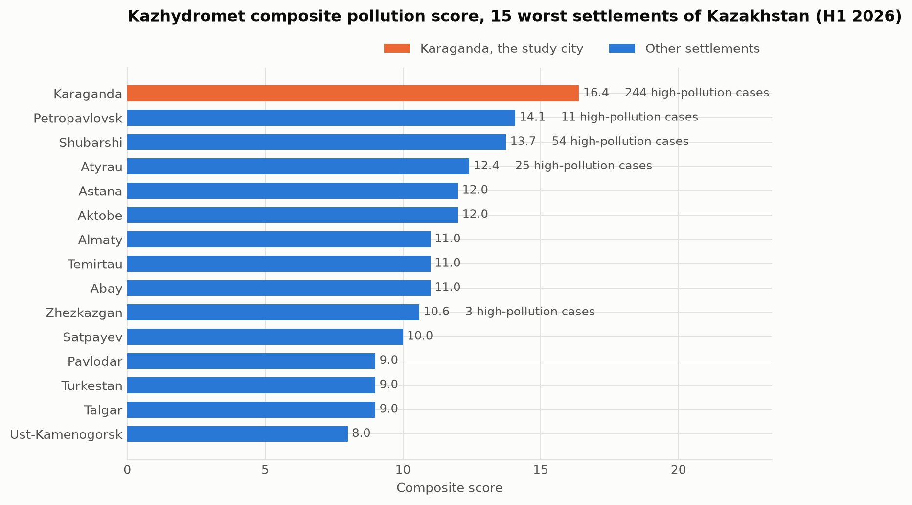
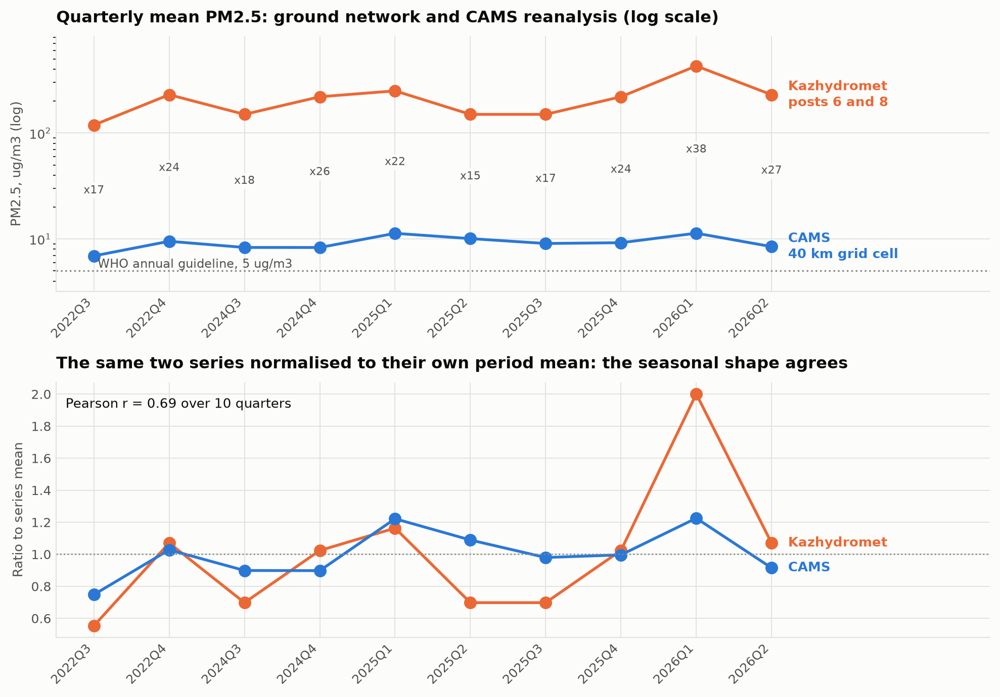
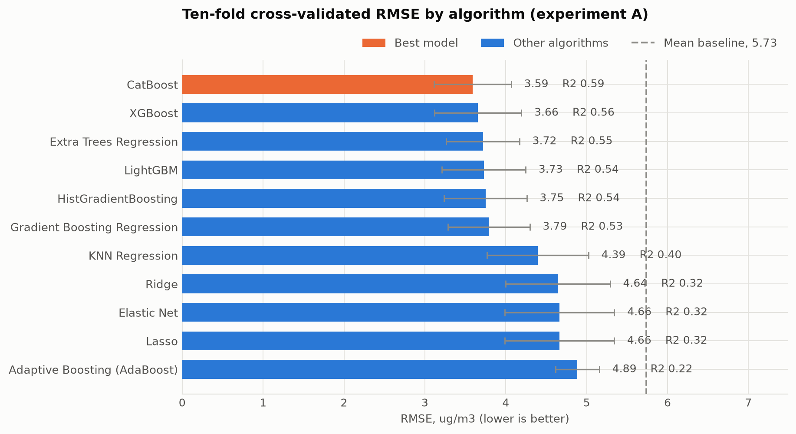
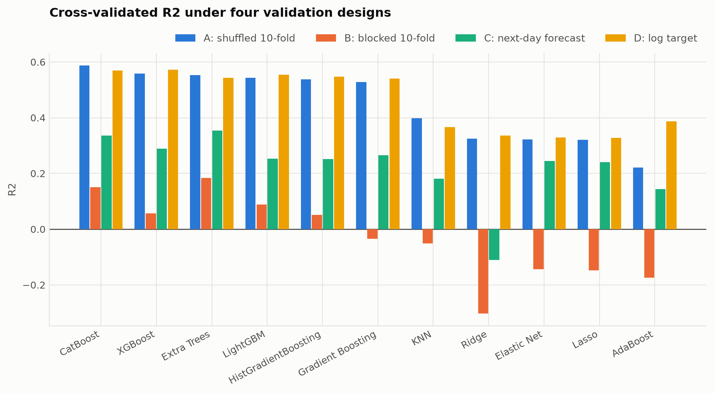
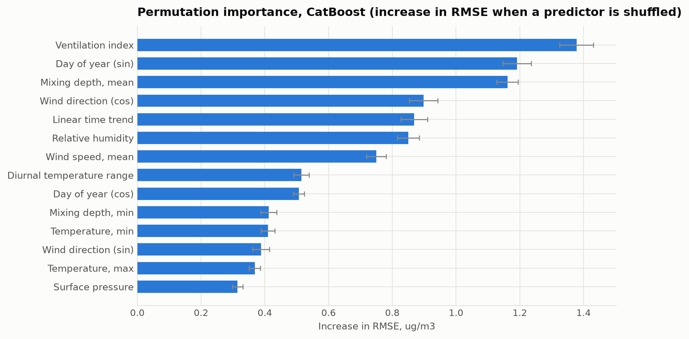
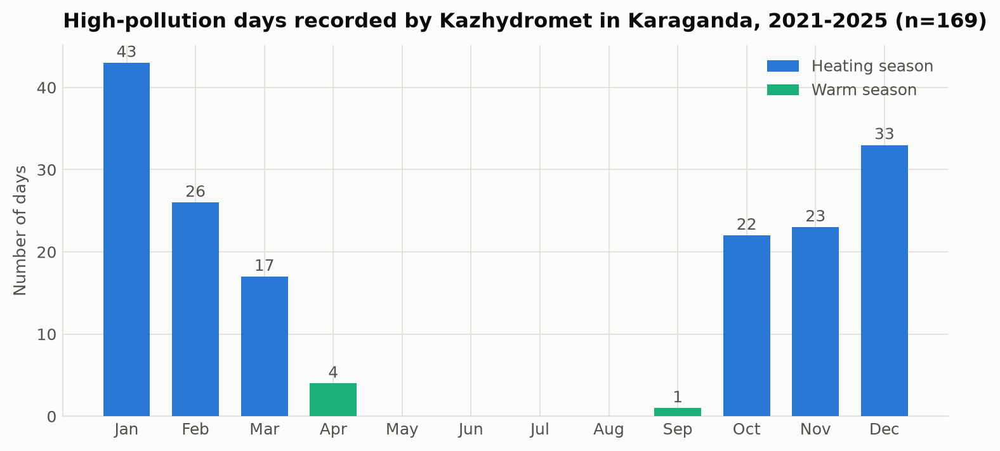

## Predicting PM2.5 in Karaganda, Kazakhstan

Eleven machine-learning algorithms, ten-fold validation, four years of daily data

**Course:** Artificial Intelligence and Machine Learning, Astana IT University

**Case Study Task 1 and the research article, combined into one project**

Data: Kazhydromet bulletins 2021-2026, CAMS and ERA5 reanalysis, 1503 modelled days

## The problem

- Karaganda is **first among 70 monitored settlements** of Kazakhstan, and recorded **244 of the country's 337 high-pollution episodes** in the first half of 2026
- Two competing explanations, with very different policy consequences:
- **Emissions** - respond with fuel substitution and industrial regulation, over a decade
- **Dispersion** - respond with episode forecasting and heating-load management, within a season
- Separating them needs daily data and a model, not annual averages
- Complication: the whole national ranking rests on **two instruments in one district**
- The calendar alone barely helps: the repeatable annual cycle is only **6.3 % of daily variance**, against **89 % synoptic weather**

## Karaganda leads the national ranking

## Literature: what is already established

- **Coal combustion dominates Kazakh winter emissions** - confirmed by the COVID-19 lockdown natural experiment, where winter peaks survived a collapse in traffic (Baimatova et al., 2022)
- **Mixing depth is a first-order control** on surface PM2.5 in Almaty (Tursumbayeva et al., 2022) - but Almaty is a mountain basin, Karaganda is flat steppe
- **Source apportionment** resolves coal, secondary aerosol and industry as leading contributors across Kazakh cities (Tursun et al., 2025)
- **Boosted tree ensembles** consistently outperform alternatives for PM2.5 prediction (Aman et al., 2025; Makhdoomi et al., 2025)
- **Gap:** no study covers Karaganda, the worst-ranked settlement in the country

## Data and features

| Source | What it gives | Coverage |
|---|---|---|
| Kazhydromet bulletins | 15 substances, 169 episode days, 105 emitters | 24 periods, 2021-2026 |
| CAMS reanalysis | Daily PM2.5, PM10, NO2, SO2, CO, O3 | 1503 days, 40 km cell |
| ERA5 reanalysis | Temperature, wind, pressure, mixing depth | 2083 days |
| National bulletins | Composite ranking of 70 settlements | 2025-2026 |

**Target:** daily mean PM2.5. **21 predictors**, no pollutant among them.

Engineered: **ventilation index** (wind x mixing depth), **heating degree days**, circular sine/cosine encodings of wind direction and day of year.

## The two data sources disagree by 20x

## Reconciling them

- The 40 km reanalysis cell averages the city with open steppe - it **must underestimate** an urban plume
- The ground posts sit in Prishakhtinsk next to coal-burning housing, and report a **PM2.5/PM10 ratio of 0.90-1.00** against a normal urban 0.5-0.7 - the instrument is not resolving the fractions
- An independent commercial estimate for 2024 sits near **105 ug/m3**, midway on a log scale
- **Conclusion:** the true annual mean is between roughly 30 and 150 ug/m3, that is **6 to 30 times the WHO guideline**
- Timing is trustworthy, absolute level is not - so every claim about level is stated as a range

## Table 1: eleven algorithms, ten-fold validation

| Algorithm | RMSE, ug/m3 | R2 |
|---|---|---|
| Ridge / Lasso / Elastic Net | 4.64 - 4.66 | 0.32 |
| KNN Regression | 4.39 | 0.40 |
| Adaptive Boosting (AdaBoost) | 4.89 | 0.22 |
| Gradient Boosting | 3.79 | 0.53 |
| HistGradientBoosting | 3.75 | 0.54 |
| LightGBM | 3.73 | 0.54 |
| Extra Trees | 3.72 | 0.55 |
| XGBoost | 3.66 | 0.56 |
| **CatBoost** | **3.59** | **0.587** |
| Mean baseline | 5.74 | -0.01 |

## Ensembles beat linear models by 0.26 in R2

## The methodological finding: shuffling inflates the score

## Why that matters

- A shuffled 10-fold split puts days from **the same weather episode** on both sides of the partition - the target has a lag-1 autocorrelation of **0.609**
- Measured against the matching baseline, skill falls from a **37.4%** error reduction to **21.3%**
- About **two fifths of the apparent skill is an artefact** of the validation design
- Adding lagged pollutant history restores it to **29.5%** in a genuine next-day forecast
- Fitting on log(PM2.5) barely changes the ranking, so the result is not an artefact of target skew
- **Takeaway:** report the shuffled score as an upper bound; the blocked check costs one extra run

## What the model learned - and an independent check

## Measured episodes confirm the mechanism

| Heating-season median | Ordinary days | High-pollution days |
|---|---|---|
| Mean temperature, C | -4.5 | -11.1 |
| Mean wind speed, km/h | 16.4 | 8.3 |
| Minimum mixing depth, m | 135 | 30 |
| Surface pressure, hPa | 956.8 | 961.8 |

The two variables the model relies on most are the two that separate **169 instrument-measured episodes** from ordinary days.

High pressure, hard frost, calm, a mixing layer tens of metres deep: a textbook surface inversion. Flat steppe traps pollution as effectively as Almaty's mountain basin.

## The season sets the level, the weather picks the day

## Recommendations

- **Now:** build an episode forecasting service - free data, open-source tools, roughly 30% error reduction. Trigger: forecast wind below 8 km/h with mixing depth below 50 m in the heating season
- **Now:** deploy 20 calibrated low-cost sensors. Karaganda has 2, Almaty has 153. This resolves more uncertainty than any further analysis of the existing record
- **Now:** fix the reference instruments - the PM2.5/PM10 ratio anomaly undermines the numbers the national ranking rests on
- **3-5 years:** target domestic coal burning in Prishakhtinsk; regulate ash and volatile content of household coal; require continuous stack monitoring at the largest emitters
- **5-10 years:** decarbonise heat supply, preserve ventilation corridors, converge national limits towards the WHO guidelines

## Conclusions and future work

- Meteorology and season explain **58.7% of daily PM2.5 variance**; CatBoost is best at RMSE **3.59 ug/m3**
- The calendar alone explains 8%, so nearly all of that signal is weather, not season
- Karaganda has an **emission problem expressed through a dispersion bottleneck** - emissions run year-round, the winter anticyclone converts them into episodes
- The **ventilation index** is the dominant predictor, confirmed independently by 169 measured episodes
- **Validation design is not a detail:** shuffled 10-fold overstates generalisation by roughly two fifths on this data
- **Limitations:** the target is a reanalysis, not a measurement; the model underpredicts above 20 ug/m3
- **Future work:** kilometre-scale satellite PM2.5 to resolve the urban plume; a quantile objective calibrated on the upper tail that an early-warning system actually needs
- **Reproducible end to end:** four scripts, no API keys, no manual steps, each ending in assertion-based self-checks that fail loudly rather than emitting wrong numbers silently
- One data defect found and documented in `KNOWN_ISSUES.md` rather than quietly worked around

**Thank you. Questions?**
